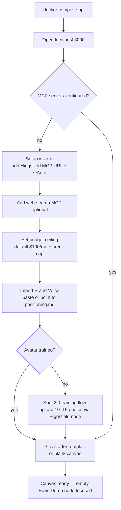
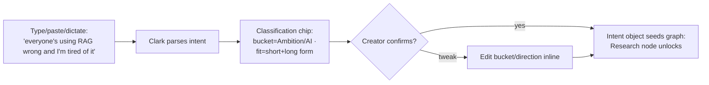
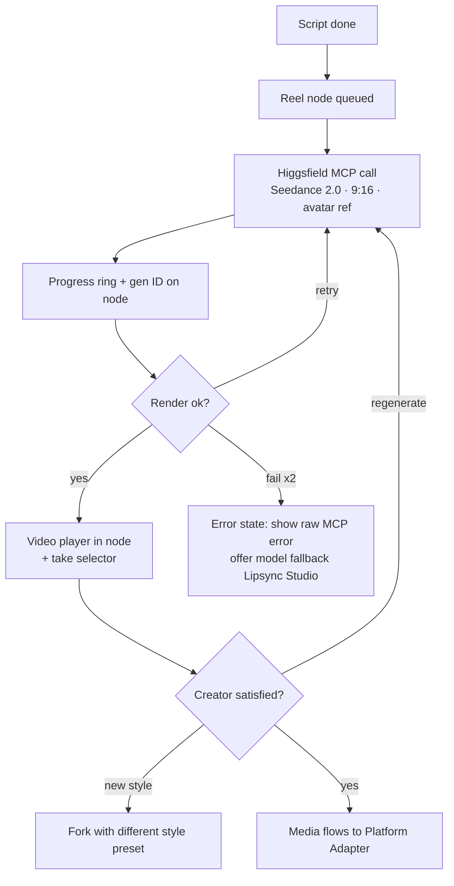
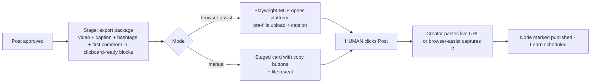

# Clark Pro — User Flows

**Status:** Draft v1 · July 2026
Flows are grouped by the eight feature sections defined in [01-product-description.md](01-product-description.md). Each flow lists the happy path, the key decision points, and the edge cases that must be designed (not discovered in QA). Persona throughout: **the solo operator-creator** (Tier 1).

---

## F0 — First-Run Setup (crosses F1 + F8)

### Flow 0.1 — Install → first canvas

**Steps**
1. Creator runs `docker compose up`; app serves on localhost. No account, no cloud.
2. Setup wizard demands exactly three things before first run: **Higgsfield MCP auth**, **budget ceiling**, **brand voice**. Everything else is optional and skippable.
3. Avatar training is offered but skippable (image/carousel content works without it).
4. Wizard ends by opening the **Short-form triple** template with an empty, focused Brain Dump node — the first action is obvious.

**Edge cases**
- Higgsfield OAuth fails → wizard shows tool-level error, links to token docs, allows "continue without media" (Script/Carousel-text nodes still work).
- No brand voice provided → generation runs with a warning chip on every Script node ("no voice loaded — output will be generic").
- Budget ceiling of $0 → allowed; run bar shows "dry-run mode": all media nodes stub out with placeholders.

---

## F1 — Canvas & Graph Engine

### Flow 1.1 — Operating a running graph

1. Creator hits **Run** (or **Run to Approval**) on the run bar.
2. Orchestrator computes execution order; nodes queue. Active node **glows**, output **streams in live** (text types out; images resolve; video shows a progress ring with the Higgsfield generation ID).
3. Creator can pan/zoom freely while running; the inspector follows the selected node, not the running one.
4. Run completes → terminal nodes show `done`; run bar summarizes cost (credits + tokens) and duration.

### Flow 1.2 — Interrupt & steer mid-run

1. Creator clicks a running node → **Stop node** (kills that task, keeps upstream results).
2. Edits the node's input in the inspector (e.g., rewrites the angle text).
3. Orchestrator diffs the graph: downstream nodes flip to `stale` (dimmed).
4. Creator hits **Resume** → only stale nodes re-run.

**Edge cases:** stopping a media node mid-render must cancel or orphan the Higgsfield job *and stop metering it*; double-edit during re-plan queues the second diff.

### Flow 1.3 — Version & fork a node

1. Any node's inspector shows a **version stack** (v1, v2, …) — every regenerate appends, never overwrites.
2. **Fork** creates a sibling branch from the selected version; downstream of the fork is empty and runnable.
3. **Branch/Compare node** pins two versions side-by-side; "Promote" makes one canonical and marks the loser's downstream stale.

**Edge cases:** version stacks cap at N=20 with LRU pruning of *unreferenced* media files (disk is finite); promoting a version that references deleted media prompts re-render.

---

## F2 — Idea Intake (Brain Dump)

### Flow 2.1 — Messy idea in, structured intent out

**Steps**
1. Input accepts raw text, a URL, a voice memo (transcribed), or a screenshot (described).
2. Clark returns a classification **as an editable chip**, not a hidden decision: content bucket, platform fit, proposed direction (one sentence).
3. Confirm (or edit) → the intent object flows to Research. On high autonomy, classification auto-confirms after 5 seconds.

**Edge cases:** input matches no bucket → chip shows "unclassified," run proceeds, Learn node later tags actuals; multiple ideas in one dump → Clark proposes splitting into 2 Brain Dump nodes.

---

## F3 — Idea Intelligence (Research & Angles)

### Flow 3.1 — Research brief

1. Research node runs as a multi-step agent: web search MCP → trends MCP → performance-memory read.
2. Node streams the brief in three collapsible blocks: **claims + sources**, **saturation/opportunity read**, **"your history says"** (from memory; absent in week 1 — shows "no memory yet, will build as you publish").
3. Creator can pin/delete individual claims; pinned claims are guaranteed to survive into Script context.

### Flow 3.2 — Angle selection (the fork point)

1. Angles node emits 3–6 angle cards: title, one-liner, predicted strength (with the *why* — e.g., "explainers beat hot-takes 1.4× in your history"), platform fit badges.
2. **Low autonomy:** run pauses; creator picks 1+ angles; each pick forks a branch with its own Script chain.
3. **High autonomy:** Clark auto-picks the top-ranked angle and proceeds; the unpicked cards remain on canvas, one click from becoming branches later.

**Edge cases:** all angles feel wrong → "Regenerate with note" (creator adds steering text); zero research sources found (offline/no search MCP) → Angles runs from intent + memory only, flagged "unresearched."

---

## F4 — Content Generation (Script & Media)

### Flow 4.1 — Platform-aware scripts (parallel)

1. One Script node per target platform spawns from the chosen angle (template decides the platform set).
2. All Script nodes run **in parallel**, each injected with: angle + research (pinned claims) + Brand Voice + platform format rules.
3. Each node renders as an **editable text editor** — human edits create a new version and mark downstream media stale.

### Flow 4.2 — Media render (Higgsfield)

**Edge cases:** credit ceiling reached mid-render → node pauses in `blocked-budget` state, run bar shows ceiling banner with "raise ceiling" (explicit action, never automatic); render exceeds 10-min timeout → job survives app restart via run-state persistence and resumes polling.

---

## F5 — Platform Assembly & Approval

### Flow 5.1 — Approval gate (the trust moment)

1. All branches converge at the Approval node; the run **pauses visibly** (gate icon pulses; optional desktop notification).
2. Creator opens the **review surface**: one tab per platform, each a *native-looking preview* (TikTok vertical player with caption overlay; LinkedIn card with "see more" fold; newsletter in email frame).
3. Per post, three actions:
   - **Approve** → moves to Publish.
   - **Request changes** → creator writes a note; Clark regenerates *only the affected node chain* (e.g., new hook → re-render reel), and the post returns to the gate.
   - **Reject** → branch archived, visible but inert.
4. "Approve all" exists but is deliberately secondary to per-post review.

**Edge cases:** partial approval (2 of 3 platforms) → approved ones proceed, others wait — the gate is per-post, not all-or-nothing; changes requested twice on the same node → suggest human edit instead of a third regeneration (cost + convergence guard).

---

## F6 — Publishing (API + Assisted)

### Flow 6.1 — API publish (YouTube, X, LinkedIn-approved, IG Business)

1. Publish node fires per the Schedule node's time (or immediately).
2. On success, node shows **live post URL + post ID**; Learn node auto-schedules for N days later.
3. On API failure → 2 retries with backoff → falls back to **staged mode** (never blocks: the post is always available for manual upload).

### Flow 6.2 — Assisted publish (TikTok, Substack, Medium, IG personal)

**Design rule made concrete:** the staged card must make manual publishing ≤ 60 seconds — one file reveal + copy-paste blocks in platform order.

**Edge cases:** creator never pastes the URL → post sits in `published-unverified` for 48h, then nags once; Learn can still run on manual analytics entry. Browser assist hits a platform UI change → degrade to manual staged card, log a node-manifest issue.

---

## F7 — Learning Loop & Performance Memory

### Flow 7.1 — Automatic learn cycle

1. Learn node wakes N days post-publish (default 5).
2. Pulls analytics via platform MCP where available; otherwise flips to manual-entry state.
3. Attributes metrics back through the graph: idea → angle → hook → format → platform → result.
4. Writes performance memory; node displays a human-readable summary: *"Explainer hook held 62% retention — 1.4× your hot-take average. Memory updated."*

### Flow 7.2 — Manual analytics entry (week-1 reality)

1. Learn node in manual state shows a 30-second form per post: views, likes, comments, retention % (optional), saves/shares.
2. Sunday-review flow: **Library → "This week"** lists all published posts with empty metrics; creator fills them in one sitting — this *is* the Creator plan's Sunday ritual, inside the product.

**Edge cases:** metrics entered twice → last write wins with history; a post deleted on-platform → mark `dead`, exclude from memory; conflicting attribution (same reel on TikTok + IG) → attribute per-platform, never merged.

---

## F8 — Templates, Library, Settings & Budget

### Flow 8.1 — Start from template
1. Library → Templates → pick (e.g., **Short-form triple**). Canvas instantiates the pre-wired graph with empty input nodes; Brain Dump focused. Creator types and hits Run — wiring never touched.

### Flow 8.2 — Save a graph as template
1. Any completed graph → "Save as template" → inputs are emptied, structure + node configs kept; appears in Library. (This is how the creator's evolved workflows become product assets.)

### Flow 8.3 — Budget ceiling hit (must-design edge flow)
1. Cost meter (run bar) shows live spend: Higgsfield credits + token cost, per run and per month.
2. At 80% of ceiling → yellow banner. At 100% → **all pending media/agent nodes flip to `blocked-budget`; run halts; nothing silently continues.**
3. Creator either raises the ceiling (explicit, logged) or trims the graph (e.g., drop B-roll node) and resumes.

### Flow 8.4 — Add an MCP server / third-party node
1. Settings → MCP Servers → add URL + auth (or edit `clark.config.yaml`).
2. Drop a node manifest into `nodes/` (or install from a listing) → node appears in the canvas palette with its declared ports. No restart, no core changes.

---

## Flow Coverage Matrix

| Feature section | Flows | Phase |
|---|---|---|
| F0 Setup | 0.1 | 1 |
| F1 Canvas & engine | 1.1, 1.2, 1.3 | 1 (1.3 partial → 2) |
| F2 Brain dump | 2.1 | 0–1 |
| F3 Research & angles | 3.1, 3.2 | 1 |
| F4 Script & media | 4.1, 4.2 | 0–1 |
| F5 Assembly & approval | 5.1 | 1 |
| F6 Publishing | 6.1, 6.2 | 1 (staged) → 3 (API + assist) |
| F7 Learning loop | 7.1, 7.2 | 2 |
| F8 Chrome | 8.1–8.4 | 1 (basic) → 3 (full budget) → 4 (8.4 external) |
