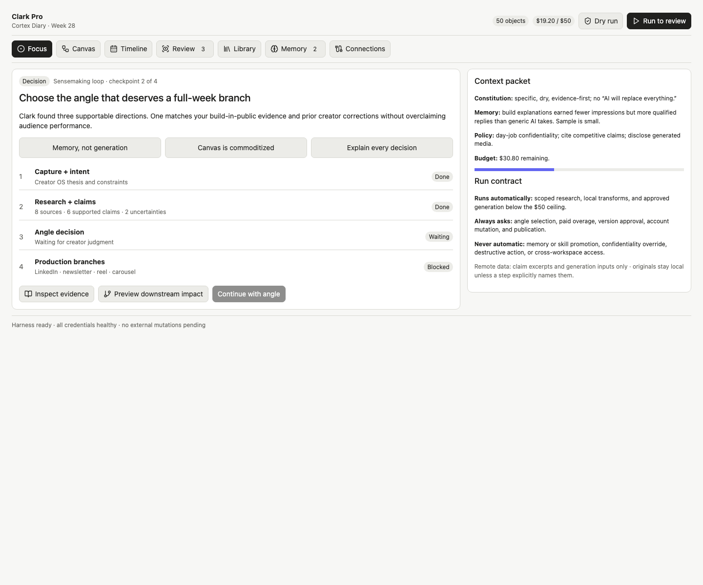
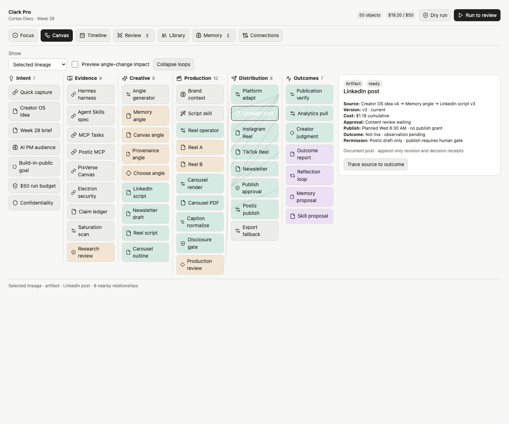
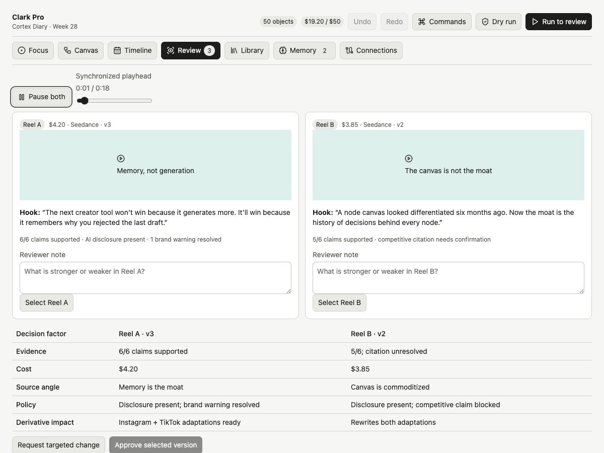
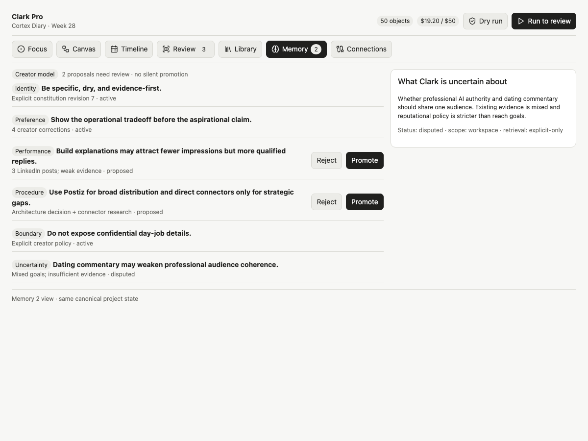
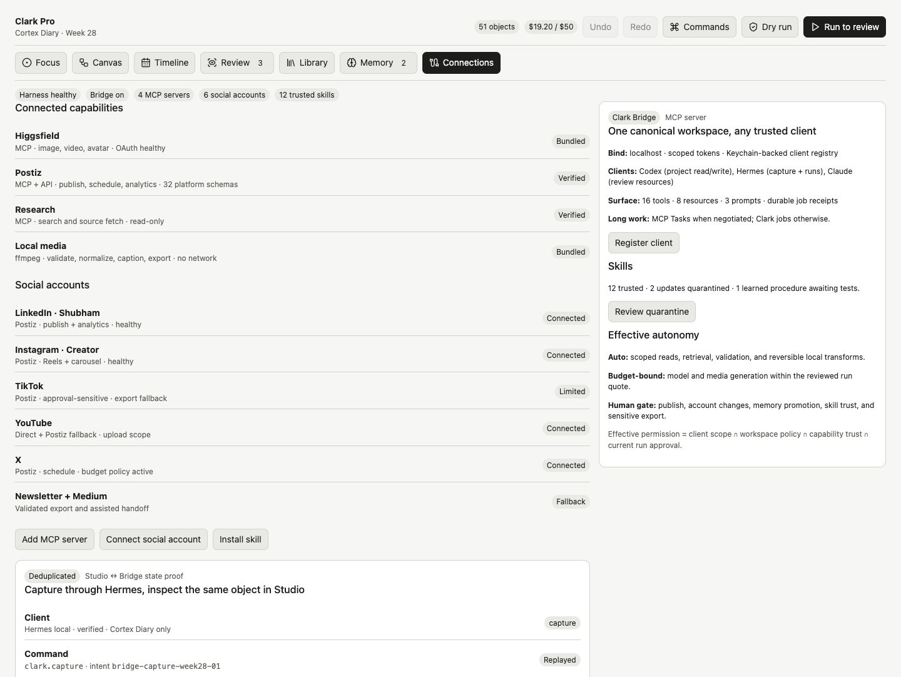
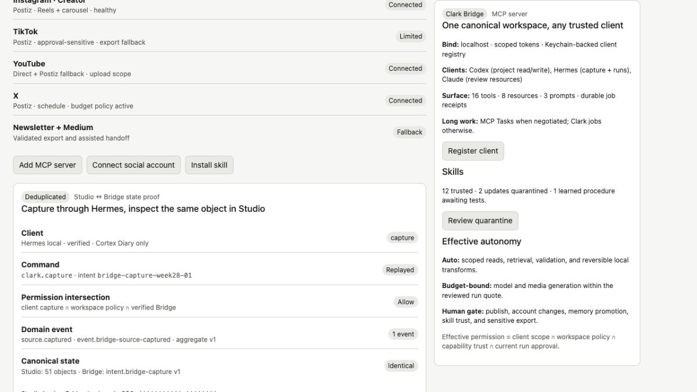

# Clark Studio Prototype

This is the Ground-stratum clickable prototype for the six-view Mac product model:

- Focus
- Canvas
- Timeline
- Review
- Library
- Memory

Connections is included as a supporting system surface for MCP servers, social accounts, Clark Bridge clients, skills, trust, and harness health.

`index.html` is the standalone Ground interaction artifact. Open it in a browser to exercise the 50-object Full-Week fixture, angle decisions, downstream-impact preview, object-level provenance contracts, reversible view/decision state, version comparison and approval, timeline, artifact library, governed memory evidence, run authority, and Connections.

The Canvas now supports click-drag panning, 65–140% zoom, fit-to-view, relationship filters, loop collapse, arrow-key movement across semantic lanes, and Enter-to-inspect. `⌘K` opens the command palette; `⌘Z` and `⇧⌘Z` undo and redo staged prototype changes. Review uses one synchronized playhead for Reel A/B and keeps evidence, cost, source angle, policy, derivative impact, annotations, selection, approval, and publication authority separate.

Connections includes a Bridge state-equivalence proof. A verified Hermes client issues `clark.capture` with capture-only workspace scope, receives one durable `source.captured` receipt, and creates the same object Canvas renders. Replaying the intent emits no new event; reloading restores the 51-object receipt-backed state for the current browser session.

The prototype validates information architecture and interaction contracts. It is not an alternate implementation path; production work follows the Electron, event, harness, memory, policy, and capability contracts in the authoritative architecture documents.

## Preview

### Focus



### Canvas



### Review



### Memory



### Connections



### Studio ↔ Bridge state proof



## Regenerate

```bash
node render.mjs /absolute/path/to/clark-studio.html index.html
```

## Review checklist

Use [prototype-evaluation.md](prototype-evaluation.md) during walkthroughs. Record evidence rather than treating the existence of the prototype as proof that the canvas gate passed.

The pre-participant expert rehearsal across five creator workflows is recorded in [cognitive-walkthroughs.md](cognitive-walkthroughs.md). It is design evidence, not human validation.

Automated interaction, responsive-layout, and visual checks are recorded in [verification.md](verification.md).
