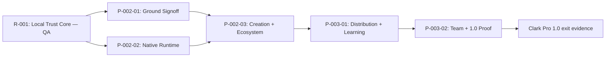

# Clark Pro Roadmap Alignment — Product, Architecture, Design, Metrics, and QA

**Project:** clark-pro
**Type:** Roadmap Alignment
**Version:** 1.0
**Created:** 2026-07-13
**Updated:** 2026-07-13

---

## Alignment Rule

The three live releases remain the roadmap source of truth. This document cross-checks each release/phase against user flows, design surfaces, infrastructure gates, product metrics, and QA evidence. It intentionally sets no calendar dates: named owners, capacity, provider choices, and commercial commitments are still open Ground evidence, so dates would be fabricated.

## Release Map

| Release / phase | Product outcome | Primary flows | Design surfaces | Architecture / infra | Metrics | QA gate |
|-----------------|-----------------|---------------|-----------------|-----------------------|---------|---------|
| R-001 Local Trust Core | Validate the bounded executable trust core already present | UF-003, UF-004, UF-005, UF-013, UF-014, UF-015 | Focus, Canvas, Memory, Connections, Tool Pack Review, Skill Review | Existing local runtime, event/recovery, governed extension boundaries | AE-001–AE-007 bounded events | TR-001 + all 15 story plans; existing automated suites; S-001-002 remains QA |
| R-002 / P-002-01 Ground Signoff | Prove comprehension, accountable ownership, security, and binding replacement signal | UF-001, UF-006 | Welcome & Trust, Workspace Setup, Focus, Canvas, Review | R-001 evidence; no bypass of human/commercial gates | AE-001 creator validation/signoff | T-001-003, T-001-004; walkthrough and purchase-signal protocols |
| R-002 / P-002-02 Native Runtime Completion | Production-trusted, portable, accessible Mac substrate | UF-001, UF-015 | Safe Recovery, Recovery Summary, Focus | AT-002-001, AT-002-002, AT-002-004 | AE-002 recovery/restore/trust gates | Backup/corruption/signing/VoiceOver/performance evidence; HP-001/002/003/009 |
| R-002 / P-002-03 Creation and Ecosystem Completion | Complete single-user creation, Bridge, memory, Tool Pack, and Skill execution | UF-002–UF-008, UF-011–UF-014 | Canvas, Review, Connections, Tool Pack/Skill surfaces, Memory | AT-002-003 plus ARCH-003 | AE-003–AE-007 | TF-006 plus story plans, conformance, hostile sandbox, migration/rollback |
| R-003 / P-003-01 Distribution and Learning | Verified publication-to-observation-to-strategy loop | UF-009, UF-010, UF-011 | Timeline, Reconciliation, Export Package, Observation, Memory | AT-003-001 | AE-008 | TF-009, publication chaos, connector outage/export, evidence honesty |
| R-003 / P-003-02 Team and Release Proof | Encrypted collaboration, scoped remote continuity, four-week 1.0 evidence | UF-006, UF-015 | Recovery Summary, Focus, Review, Timeline, Connections | AT-003-002, AT-003-003, ARCH-004 | AE-009 | TF-006 + TF-015, sync conflict/tenant corpus, four real weeks, hosted outage/local export |

## Dependency Spine

## Definition of “Through”

A roadmap item is not complete because its screen exists. It moves only when: exact story AC pass; architecture gate is open; linked design states and copy are implemented; required AE event and analytics test land; T plan and release integration tests pass; bound health probes are green; recovery, migration, security, human, and external-provider evidence required by the story are attributable; and the board/status reflects the real state.

## Current Progress Interpretation

- R-001 is in QA: 14 scoped stories are Done and S-001-002 is QA; product-level Ground is not closed.
- R-002 and R-003 remain Backlog/Draft. Their new Architecture Gates are closed by design until the listed ATs execute and verify.
- The flow, design, architecture, analytics, and QA documents are implementation contracts, not completion evidence. They improve readiness coverage without changing any story’s honest status.

## Change Log

| Date | Version | Author | Change |
|------|---------|--------|--------|
| 2026-07-13 | 1.0 | PM Agent | Aligned three releases, five phases, 15 flows, architecture gates, analytics, and QA evidence without inventing dates. |
