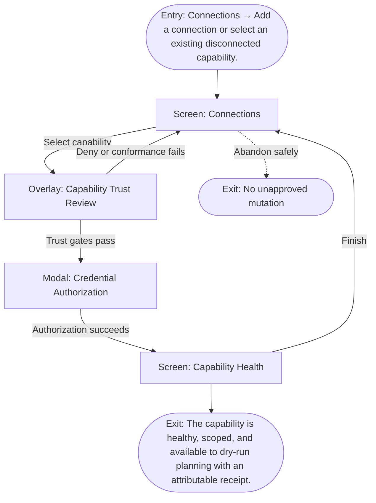

# User Flow: Connect a capability

**ID:** UF-002
**Project:** clark-pro
**Epic:** E-004, E-008
**Stage:** Ready
**Version:** 1.0
**Created:** 2026-07-13
**Updated:** 2026-07-13
**Persona:** The Trust-Conscious Operator
**Sources:** [Authoritative source flow](../../clark-pro/product/02-user-flows.md), [Product brief](../brief.md)

---

## Overview

A workspace administrator reviews authority before authorizing a capability, keeps secrets behind the credential broker, validates health and schemas, and grants only explicit workspace/action scopes.

## Entry Point

- Connections → Add a connection or select an existing disconnected capability.

## Stories Covered

- S-004-001 — Governed Bundled MCP Capability
- S-004-003 — Durable Bridge Tasks and Client Pairing
- S-008-001 — Social Account and Credential Center

## Flow

## Screens

### Screen: Connections

- **Purpose:** Manage capabilities, social accounts, MCP clients, Tool Packs, Skills, and their effective workspace authority.
- **Key content:** Source and trust filters, connection cards, health, scopes, trust states, affected schedules, revoke controls, developer mode.
- **Primary action:** Select a connection or add a governed capability.
- **Transitions:**
  - Select capability → Capability Trust Review
  - Select Tool Pack → Tool Pack Review
  - Select Skill → Skill Review
  - Register client → Client Pairing
- **Stories:** S-004-001, S-004-003, S-008-001

### Overlay: Capability Trust Review

- **Purpose:** Review publisher identity, transport, scopes, egress, cost behavior, and conformance before granting authority.
- **Key content:** Publisher, immutable revision, requested permissions, domains, credential scopes, discovery result, health, non-mutating conformance, workspace/action-class grants.
- **Primary action:** Continue to authorization or deny the capability.
- **Transitions:**
  - Authorize → Credential Authorization
  - Deny → Connections
  - Conformance failure → remain open with no grant
- **Stories:** S-004-001, S-004-003, S-008-001

### Modal: Credential Authorization

- **Purpose:** Collect OAuth or API-key authorization through the broker without exposing secret material to renderer state.
- **Key content:** Provider identity, requested scopes, redirect status, Keychain destination, cancel action, privacy note.
- **Primary action:** Authorize through the provider or cancel.
- **Transitions:**
  - Success → Capability Health
  - Cancel or denial → Capability Trust Review
  - Expired scope → remain with actionable error
- **Stories:** S-004-001, S-004-003, S-008-001

### Screen: Capability Health

- **Purpose:** Confirm discovery, schema, health, scope, and dry-run readiness after connection.
- **Key content:** Health summary, tool inventory, schema revisions, granted workspaces, action classes, latest conformance receipt, revoke and recheck actions.
- **Primary action:** Finish or run a non-mutating recheck.
- **Transitions:**
  - Finish → Connections
  - Recheck → remain
  - Revoke → Connections
- **Stories:** S-004-001, S-004-003, S-008-001

## Exit Points

- **Success:** The capability is healthy, scoped, and available to dry-run planning with an attributable receipt.
- **Abandon:** The creator can leave before the explicit decision; drafts and verified prior state remain available.
- **Error:** Invalid metadata, scope, schema, or credential leaves the capability without execution authority.

---

## Change Log

| Date | Version | Author | Change |
|------|---------|--------|--------|
| 2026-07-13 | 1.0 | PM Agent | Created from Clark Pro authoritative flow v2 and aligned to the live 42-story roadmap. |
