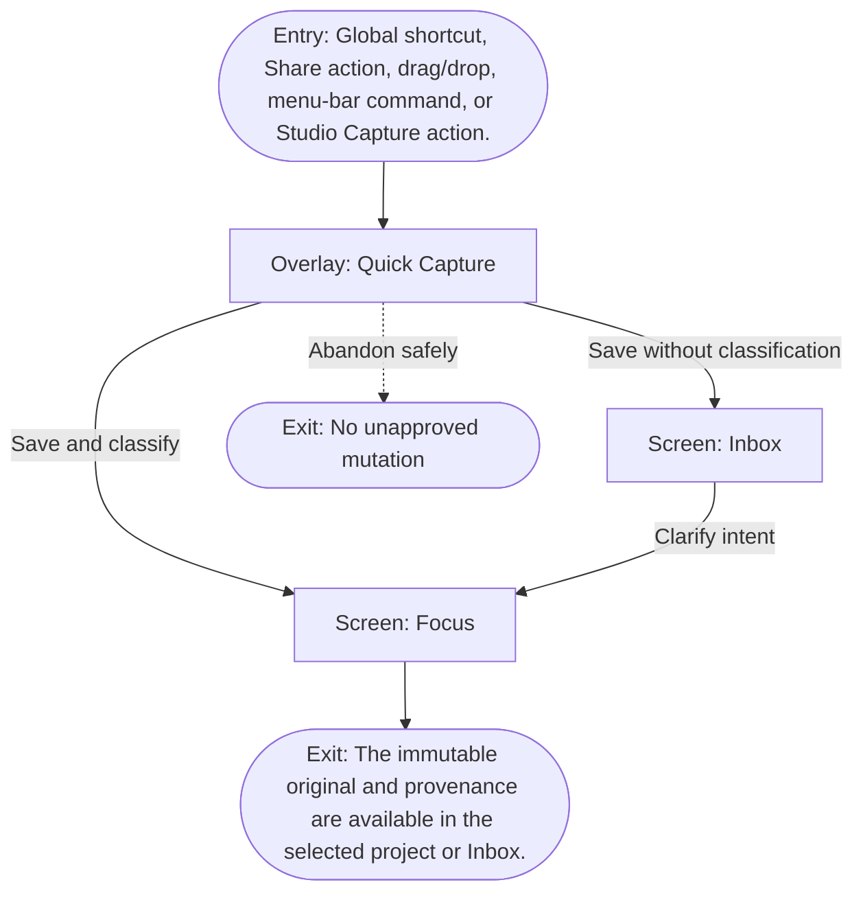

# User Flow: Quick capture

**ID:** UF-005
**Project:** clark-pro
**Epic:** E-003
**Stage:** Ready
**Version:** 1.0
**Created:** 2026-07-13
**Updated:** 2026-07-13
**Persona:** The Operator-Creator
**Sources:** [Authoritative source flow](../../clark-pro/product/02-user-flows.md), [Product brief](../brief.md)

---

## Overview

A creator preserves an original source and enough intent to route it without automatically starting research, generation, or paid work.

## Entry Point

- Global shortcut, Share action, drag/drop, menu-bar command, or Studio Capture action.

## Stories Covered

- S-003-001 — Immutable Idea Capture and Revision Lineage
- S-003-003 — Source Ingestion and Claim Ledger

## Flow

## Screens

### Overlay: Quick Capture

- **Purpose:** Capture text, URL, screenshot, file, selection, or voice without automatically starting paid research or generation.
- **Key content:** Source preview, immutable-original notice, workspace/project suggestion, intent note, Inbox option.
- **Primary action:** Save the original and classification choice.
- **Transitions:**
  - Save and classify → Focus
  - Save to Inbox → Inbox
  - Cancel → prior application
- **Stories:** S-003-001, S-003-003

### Screen: Inbox

- **Purpose:** Hold captured originals that need project or intent clarification without losing provenance.
- **Key content:** Captured item list, source type, captured time, workspace/project suggestion, missing-intent prompts, archive action.
- **Primary action:** Classify an item or open it in Focus.
- **Transitions:**
  - Classify → Focus
  - Open source → source preview
  - Archive → remain
- **Stories:** S-003-001, S-003-003

### Screen: Focus

- **Purpose:** Present the next creator decision, required inputs, active gates, and resumable work without exposing the whole graph.
- **Key content:** Inbox count, current project, next decision, run readiness, budget, selected accounts and Brand Constitution, recovery summary, recent activity.
- **Primary action:** Make the next decision or open the relevant supporting surface.
- **Transitions:**
  - Open structure or lineage → Canvas
  - Open exact-version decision → Review
  - Approved work → Timeline
  - Recovered work → remain in Focus with status
- **Stories:** S-003-001, S-003-003

## Exit Points

- **Success:** The immutable original and provenance are available in the selected project or Inbox.
- **Abandon:** The creator can leave before the explicit decision; drafts and verified prior state remain available.
- **Error:** A failed append leaves no partial canonical record and offers a retry with the source still available.

---

## Change Log

| Date | Version | Author | Change |
|------|---------|--------|--------|
| 2026-07-13 | 1.0 | PM Agent | Created from Clark Pro authoritative flow v2 and aligned to the live 42-story roadmap. |
