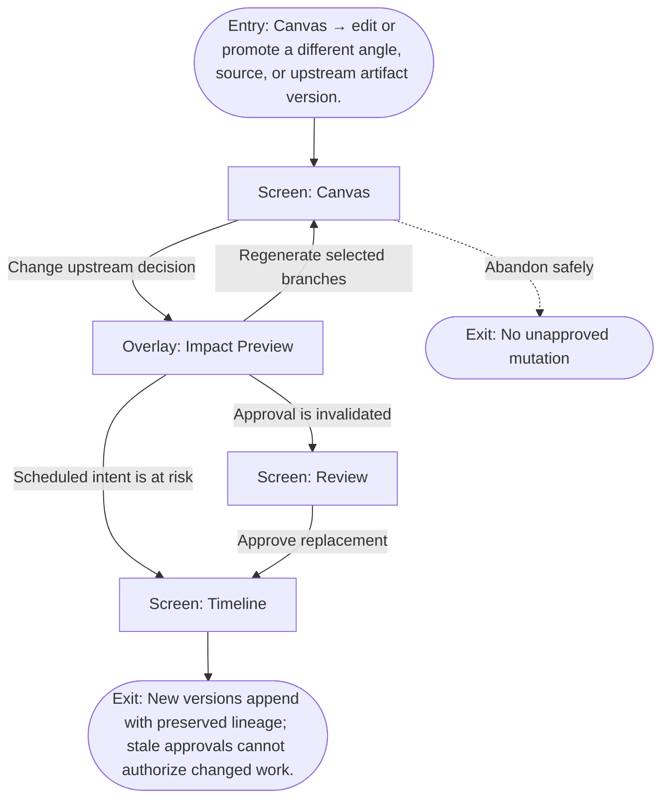

# User Flow: Change an upstream decision

**ID:** UF-007
**Project:** clark-pro
**Epic:** E-003, E-008
**Stage:** Ready
**Version:** 1.0
**Created:** 2026-07-13
**Updated:** 2026-07-13
**Persona:** The Operator-Creator
**Sources:** [Authoritative source flow](../../clark-pro/product/02-user-flows.md), [Product brief](../brief.md)

---

## Overview

A creator changes an upstream decision, sees deterministic downstream impact, chooses what to regenerate, and reconciles approvals and schedules before publication.

## Entry Point

- Canvas → edit or promote a different angle, source, or upstream artifact version.

## Stories Covered

- S-003-001 — Immutable Idea Capture and Revision Lineage
- S-003-002 — Evidence-Honest Idea Inspection and Canvas
- S-003-005 — Version-Specific Review and Policy Gates
- S-008-002 — Postiz Scheduling and Publication Ledger

## Flow

## Screens

### Screen: Canvas

- **Purpose:** Expose the typed creative graph, lineage, evidence gaps, decisions, branches, staleness, and run state as an inspectable projection.
- **Key content:** Lanes, typed nodes, edges, selected-node inspector, evidence readiness, lineage, stale markers, branch controls, keyboard help.
- **Primary action:** Inspect or change an upstream decision and preview consequences.
- **Transitions:**
  - Open review gate → Review
  - Change decision → Impact Preview
  - Return to next decision → Focus
- **Stories:** S-003-001, S-003-002, S-003-005, S-008-002

### Overlay: Impact Preview

- **Purpose:** Show which downstream artifacts, approvals, schedules, costs, and reusable work change after an upstream decision.
- **Key content:** Changed input, stale artifacts, reusable outputs, invalidated approvals, scheduled-publication risk, estimated regeneration cost, branch selection.
- **Primary action:** Choose branches to regenerate or preserve manually.
- **Transitions:**
  - Confirm regeneration → Canvas
  - Preserve manually → Canvas with explicit exception
  - Scheduled risk → Timeline
- **Stories:** S-003-001, S-003-002, S-003-005, S-008-002

### Screen: Review

- **Purpose:** Compare exact artifact versions with evidence, policy, cost, lineage, and creator decisions before mutation.
- **Key content:** Review queue, paired text diff or synchronized media, sources, model/provider, Skill and memory revisions, policies, annotations, cost, approval status.
- **Primary action:** Select, edit, reject, or request targeted changes.
- **Transitions:**
  - Compare versions → Version Comparison
  - Decide → Approval Decision
  - Approved for distribution → Timeline
  - Inspect lineage → Canvas
- **Stories:** S-003-001, S-003-002, S-003-005, S-008-002

### Screen: Timeline

- **Purpose:** Coordinate approved artifacts, account requirements, schedules, submission, verification, and reconciliation states.
- **Key content:** Calendar/list modes, artifact and account, approval state, platform requirements, scheduled time, publication state, receipts, affected-account warnings.
- **Primary action:** Schedule, publish now, reschedule, reconcile, cancel, or export.
- **Transitions:**
  - Schedule or publish → Publication Approval
  - Ambiguous state → Reconciliation
  - Unavailable connector → Export Package
  - Open artifact → Review
- **Stories:** S-003-001, S-003-002, S-003-005, S-008-002

## Exit Points

- **Success:** New versions append with preserved lineage; stale approvals cannot authorize changed work.
- **Abandon:** The creator can leave before the explicit decision; drafts and verified prior state remain available.
- **Error:** Impact calculation failure blocks regeneration and leaves existing canonical artifacts and schedules inspectable.

---

## Change Log

| Date | Version | Author | Change |
|------|---------|--------|--------|
| 2026-07-13 | 1.0 | PM Agent | Created from Clark Pro authoritative flow v2 and aligned to the live 42-story roadmap. |
