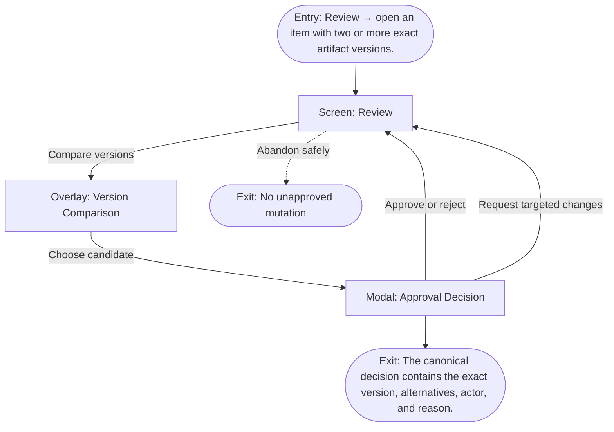

# User Flow: Compare and approve

**ID:** UF-008
**Project:** clark-pro
**Epic:** E-003
**Stage:** Ready
**Version:** 1.0
**Created:** 2026-07-13
**Updated:** 2026-07-13
**Persona:** The Operator-Creator
**Sources:** [Authoritative source flow](../../clark-pro/product/02-user-flows.md), [Product brief](../brief.md)

---

## Overview

A reviewer compares text or media with evidence, provider, Skill, memory, policy, cost, and annotations, then records a decision bound to one exact version.

## Entry Point

- Review → open an item with two or more exact artifact versions.

## Stories Covered

- S-003-002 — Evidence-Honest Idea Inspection and Canvas
- S-003-005 — Version-Specific Review and Policy Gates

## Flow

## Screens

### Screen: Review

- **Purpose:** Compare exact artifact versions with evidence, policy, cost, lineage, and creator decisions before mutation.
- **Key content:** Review queue, paired text diff or synchronized media, sources, model/provider, Skill and memory revisions, policies, annotations, cost, approval status.
- **Primary action:** Select, edit, reject, or request targeted changes.
- **Transitions:**
  - Compare versions → Version Comparison
  - Decide → Approval Decision
  - Approved for distribution → Timeline
  - Inspect lineage → Canvas
- **Stories:** S-003-002, S-003-005

### Overlay: Version Comparison

- **Purpose:** Compare text or synchronized media versions without losing evidence and technical differences.
- **Key content:** Side-by-side versions, synchronized playback, diff markers, source/evidence changes, cost, policy and accessibility changes, annotations.
- **Primary action:** Select a candidate or return without deciding.
- **Transitions:**
  - Select candidate → Approval Decision
  - Close → Review
- **Stories:** S-003-002, S-003-005

### Modal: Approval Decision

- **Purpose:** Bind approval, rejection, edit, or change request to one exact artifact version and actor.
- **Key content:** Exact version hash, selected alternative, required gates, reason/note, reversibility, impacted platform adaptations.
- **Primary action:** Approve, reject, or request changes.
- **Transitions:**
  - Approve → Review or Timeline
  - Reject → Review
  - Request changes → Focus
- **Stories:** S-003-002, S-003-005

## Exit Points

- **Success:** The canonical decision contains the exact version, alternatives, actor, and reason.
- **Abandon:** The creator can leave before the explicit decision; drafts and verified prior state remain available.
- **Error:** Disputed sources, missing disclosure, policy conflict, unsafe claims, media failure, or upstream staleness prevent approval.

---

## Change Log

| Date | Version | Author | Change |
|------|---------|--------|--------|
| 2026-07-13 | 1.0 | PM Agent | Created from Clark Pro authoritative flow v2 and aligned to the live 42-story roadmap. |
