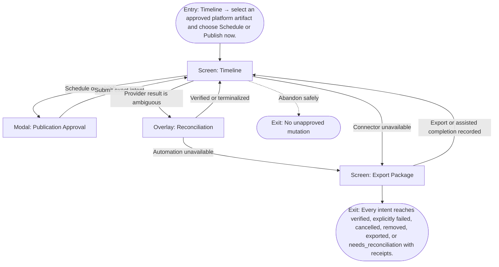

# User Flow: Schedule and publish

**ID:** UF-009
**Project:** clark-pro
**Epic:** E-008
**Stage:** Ready
**Version:** 1.0
**Created:** 2026-07-13
**Updated:** 2026-07-13
**Persona:** The Operator-Creator
**Sources:** [Authoritative source flow](../../clark-pro/product/02-user-flows.md), [Product brief](../brief.md)

---

## Overview

A creator validates account and platform requirements, commits an idempotent publication intent, observes the provider outcome, reconciles ambiguity, and falls back to deterministic export when needed.

## Entry Point

- Timeline → select an approved platform artifact and choose Schedule or Publish now.

## Stories Covered

- S-008-001 — Social Account and Credential Center
- S-008-002 — Postiz Scheduling and Publication Ledger
- S-008-003 — Assisted Handoff and Deterministic Export

## Flow

## Screens

### Screen: Timeline

- **Purpose:** Coordinate approved artifacts, account requirements, schedules, submission, verification, and reconciliation states.
- **Key content:** Calendar/list modes, artifact and account, approval state, platform requirements, scheduled time, publication state, receipts, affected-account warnings.
- **Primary action:** Schedule, publish now, reschedule, reconcile, cancel, or export.
- **Transitions:**
  - Schedule or publish → Publication Approval
  - Ambiguous state → Reconciliation
  - Unavailable connector → Export Package
  - Open artifact → Review
- **Stories:** S-008-001, S-008-002, S-008-003

### Modal: Publication Approval

- **Purpose:** Confirm platform schema, account health, disclosure, exact artifact version, schedule, cost, and idempotent intent before external mutation.
- **Key content:** Account and platform, artifact version, schema validation, disclosures, scheduled time, idempotency intent, policy result, fallback.
- **Primary action:** Submit the exact publication intent or cancel.
- **Transitions:**
  - Submit → Timeline in submitting state
  - Policy block → Review
  - Cancel → Timeline
- **Stories:** S-008-001, S-008-002, S-008-003

### Overlay: Reconciliation

- **Purpose:** Resolve ambiguous external mutations and recovered work without blind retry.
- **Key content:** Intent, last known state, provider receipt, live lookup, possible outcomes, retry safety, operator choices, audit timeline.
- **Primary action:** Verify, mark failed, continue observing, export, or retry only when safe.
- **Transitions:**
  - Verified → Timeline
  - Continue observing → Timeline
  - Export → Export Package
  - Safe retry → Publication Approval
- **Stories:** S-008-001, S-008-002, S-008-003

### Screen: Export Package

- **Purpose:** Produce a deterministic, platform-valid handoff with complete lineage when automation cannot proceed.
- **Key content:** Artifact files, copy, metadata, disclosures, technical validation, checksums, platform instructions, lineage manifest, assisted-result recording.
- **Primary action:** Export the package or record an assisted completion.
- **Transitions:**
  - Export → Timeline in exported state
  - Record assisted result → Timeline
  - Back → Timeline
- **Stories:** S-008-001, S-008-002, S-008-003

## Exit Points

- **Success:** Every intent reaches verified, explicitly failed, cancelled, removed, exported, or needs_reconciliation with receipts.
- **Abandon:** The creator can leave before the explicit decision; drafts and verified prior state remain available.
- **Error:** No ambiguous external mutation is blind-retried and no connector outage loses an approved artifact.

---

## Change Log

| Date | Version | Author | Change |
|------|---------|--------|--------|
| 2026-07-13 | 1.0 | PM Agent | Created from Clark Pro authoritative flow v2 and aligned to the live 42-story roadmap. |
