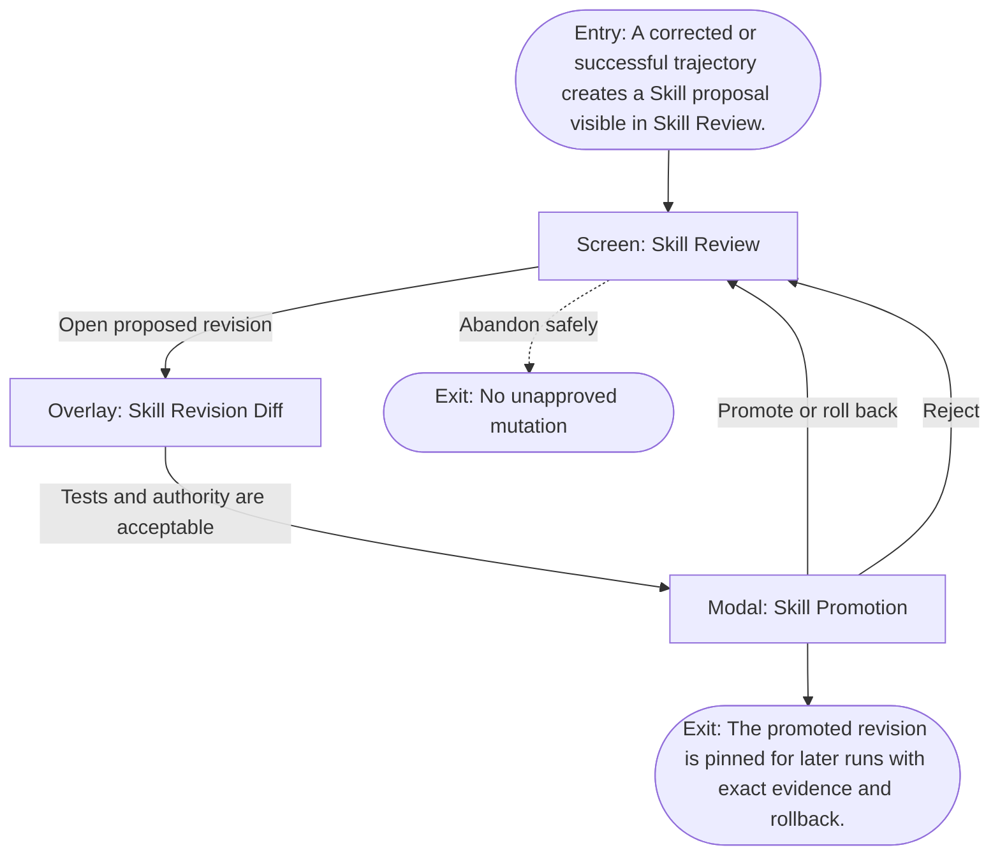

# User Flow: Learn or revise a Skill

**ID:** UF-012
**Project:** clark-pro
**Epic:** E-007
**Stage:** Ready
**Version:** 1.0
**Created:** 2026-07-13
**Updated:** 2026-07-13
**Persona:** The Operator-Creator
**Sources:** [Authoritative source flow](../../clark-pro/product/02-user-flows.md), [Product brief](../brief.md)

---

## Overview

A creator reviews the extracted procedure, authority, tests, examples, and revision diff before promotion; regression can propose rollback but never rewrite the active Skill silently.

## Entry Point

- A corrected or successful trajectory creates a Skill proposal visible in Skill Review.

## Stories Covered

- S-007-002 — Skill Update, Expansion Denial, and Rollback
- S-007-005 — Reflection-Driven Skill Proposals and Regression

## Flow

## Screens

### Screen: Skill Review

- **Purpose:** Inspect exact Skill bytes, requested tools, effective permission intersection, compatibility, fixtures, and trust ceiling.
- **Key content:** Source hash, files, hidden-executable scan, requested tools/domains, installed capabilities, effective permission intersection, fixture results, revision history.
- **Primary action:** Open promotion decision or compare a revision.
- **Transitions:**
  - Promote or limit → Skill Promotion
  - Compare update → Skill Revision Diff
  - Reject → Skill Library
- **Stories:** S-007-002, S-007-005

### Overlay: Skill Revision Diff

- **Purpose:** Compare procedure, tools, permissions, compatibility, fixtures, and recovery behavior between Skill revisions.
- **Key content:** File diff, manifest diff, capability expansion, permission changes, fixture/regression results, compatibility, rollback target.
- **Primary action:** Continue to promotion or keep the prior revision.
- **Transitions:**
  - Promote candidate → Skill Promotion
  - Keep prior → Skill Review
- **Stories:** S-007-002, S-007-005

### Modal: Skill Promotion

- **Purpose:** Record the explicit promotion, limitation, rejection, or rollback decision for an exact Skill revision.
- **Key content:** Revision, trust class, capability ceiling, workspace scope, fixture summary, regression result, prior rollback revision.
- **Primary action:** Promote within the shown ceiling, reject, or roll back.
- **Transitions:**
  - Promote → Skill Library
  - Reject → Skill Review
  - Rollback → Skill Library with prior revision
- **Stories:** S-007-002, S-007-005

## Exit Points

- **Success:** The promoted revision is pinned for later runs with exact evidence and rollback.
- **Abandon:** The creator can leave before the explicit decision; drafts and verified prior state remain available.
- **Error:** Failed regression, incompatible authority, or missing evidence leaves the proposal quarantined.

---

## Change Log

| Date | Version | Author | Change |
|------|---------|--------|--------|
| 2026-07-13 | 1.0 | PM Agent | Created from Clark Pro authoritative flow v2 and aligned to the live 42-story roadmap. |
