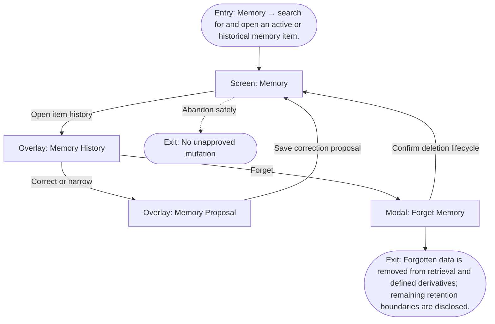

# User Flow: Correct or forget personal data

**ID:** UF-014
**Project:** clark-pro
**Epic:** E-005
**Stage:** Ready
**Version:** 1.0
**Created:** 2026-07-13
**Updated:** 2026-07-13
**Persona:** The Trust-Conscious Operator
**Sources:** [Authoritative source flow](../../clark-pro/product/02-user-flows.md), [Product brief](../brief.md)

---

## Overview

A creator inspects statement, revisions, evidence, retrieval, and influenced outputs before editing, disputing, narrowing, expiring, or forgetting personal data.

## Entry Point

- Memory → search for and open an active or historical memory item.

## Stories Covered

- S-005-002 — Scoped Retrieval, Correction, and Forgetting
- S-005-004 — Physical Erasure and Memory Validation Corpus

## Flow

## Screens

### Screen: Memory

- **Purpose:** Inspect active beliefs, proposals, evidence, scope, sensitivity, retrieval history, influence, correction, and forgetting.
- **Key content:** Memory metrics, search/filter, item list, proposal state, statement, confidence, evidence, contradictions, scope, sensitivity, expiry, retrievals, influenced artifacts.
- **Primary action:** Review a proposal or inspect/correct an active item.
- **Transitions:**
  - Open proposal → Memory Proposal
  - Open history → Memory History
  - Forget → Forget Memory
  - Inspect influenced artifact → Review
- **Stories:** S-005-002, S-005-004

### Overlay: Memory History

- **Purpose:** Show revisions, evidence, retrieval history, and influenced outputs before correction or forgetting.
- **Key content:** Revision timeline, active/disputed/expired state, evidence links, retrieval receipts, influenced artifacts, backup-retention caveat.
- **Primary action:** Inspect a revision, correct it, or continue to forgetting.
- **Transitions:**
  - Correct → Memory Proposal
  - Forget → Forget Memory
  - Close → Memory
- **Stories:** S-005-002, S-005-004

### Overlay: Memory Proposal

- **Purpose:** Review a small evidence-linked belief proposal before it can influence retrieval.
- **Key content:** Statement, evidence, contradiction, confidence, sensitivity, scope, expiry, retrieval policy, originating trajectory.
- **Primary action:** Approve, edit, dispute, defer, or reject.
- **Transitions:**
  - Decide → Memory Decision
  - Inspect evidence → Review
  - Close → Memory
- **Stories:** S-005-002, S-005-004

### Modal: Forget Memory

- **Purpose:** Confirm logical removal, derivative deletion, audit tombstone, and disclosed backup-retention limits.
- **Key content:** Exact memory revision, retrieval removal, derivative/index deletion, active storage result, backup and export retention caveats, confirmation.
- **Primary action:** Forget the memory or cancel.
- **Transitions:**
  - Confirm → Memory
  - Cancel → Memory History
- **Stories:** S-005-002, S-005-004

## Exit Points

- **Success:** Forgotten data is removed from retrieval and defined derivatives; remaining retention boundaries are disclosed.
- **Abandon:** The creator can leave before the explicit decision; drafts and verified prior state remain available.
- **Error:** If physical removal cannot be proven across a defined boundary, Clark reports the remaining copy and blocks unsupported completion claims.

---

## Change Log

| Date | Version | Author | Change |
|------|---------|--------|--------|
| 2026-07-13 | 1.0 | PM Agent | Created from Clark Pro authoritative flow v2 and aligned to the live 42-story roadmap. |
