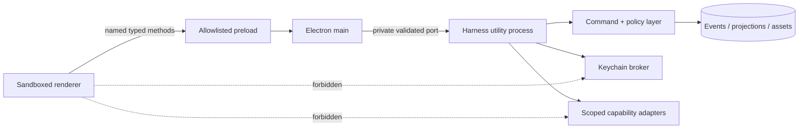

# Architecture: Local Runtime and Trust Boundaries

**ID:** ARCH-001
**Project:** clark-pro
**Type:** System Design
**Version:** 1.0
**Updated:** 2026-07-13
**Sources:** [Architecture](../../../clark-pro/architecture.md), [Implementation contracts](../../../clark-pro/product/04-architecture-and-tech-stack.md)

---

## Purpose

Define the permanent Mac process topology and the authority boundary that every UI, credential, capability, Bridge, and package story must preserve.

Connected stories: `S-002-001`, `S-002-004`, `S-004-001`, `S-004-002`, `S-004-003`, `S-008-001`, `S-009-005`. Connected flows: UF-001, UF-002, UF-013.

## The Goal

A compromised or malformed renderer can display bad pixels, but it cannot directly read secrets, execute arbitrary commands, mutate canonical state, or grant capability authority.

## Current State

The bounded Ground implementation proves the Electron/Harness/event/contract shape for selected stories. Production signing, complete provider execution, broad creator loops, remote sync, and hosted operations remain release-gated rather than assumed complete.

## Architectural Decision

### Decision

Keep Electron main/preload as a narrow native boundary and place all domain commands, credentials, capabilities, packages, and long-running work in a supervised Harness process. Renderer state is a projection and may never become an authority source.

### Rationale

This decision preserves local canonical ownership, exact-version provenance, inspectable authority, deterministic recovery, and replaceable dependencies while allowing each release to extend the same contracts.

### Alternatives Considered

| Approach | Why Rejected |
|----------|--------------|
| Node-enabled renderer | Collapses the most important trust boundary and makes any content-rendering bug a credential/execution bug. |
| One Electron main process for all work | Provider, media, or agent failure would threaten UI lifecycle and recovery. |
| Required cloud API | Violates offline ownership and makes personal canonical operation dependent on a service. |

## Design

## Constraints & Non-Goals

- No raw filesystem, shell, credential, network, MCP transport, or Harness port in renderer.
- Main owns lifecycle/native integration, not business execution.
- Localhost Bridge exposure beyond local requires TLS, scoped authentication, and explicit action.
- This architecture does not claim that a planned provider, Tool Pack, remote service, or hosted control already exists.

## Implementation Notes

- Use schema validation on both sides of IPC and sender/origin validation in main.
- Pass opaque credential references; issue short-lived leases only inside Harness execution.
- Tag every log/span with process type and release, never raw workspace content.
- Emit only allowlisted operational telemetry with correlation IDs and no raw creative, secret, identity, path, or prompt content.

## Consumed By

| Consumer | How |
|----------|-----|
| S-002-001 | Implements or verifies this architecture boundary. |
| S-002-004 | Implements or verifies this architecture boundary. |
| S-004-001 | Implements or verifies this architecture boundary. |
| S-004-002 | Implements or verifies this architecture boundary. |
| S-004-003 | Implements or verifies this architecture boundary. |
| S-008-001 | Implements or verifies this architecture boundary. |
| S-009-005 | Implements or verifies this architecture boundary. |
| UF-001, UF-002, UF-013 | Exercises the boundary through the linked user journey. |
| arch.md | Summarizes this decision for release and coding-agent handoff. |

## Change Log

| Date | Version | Author | Change |
|------|---------|--------|--------|
| 2026-07-13 | 1.0 | PM Agent | Created from accepted Clark Pro architecture and ADR evidence. |
