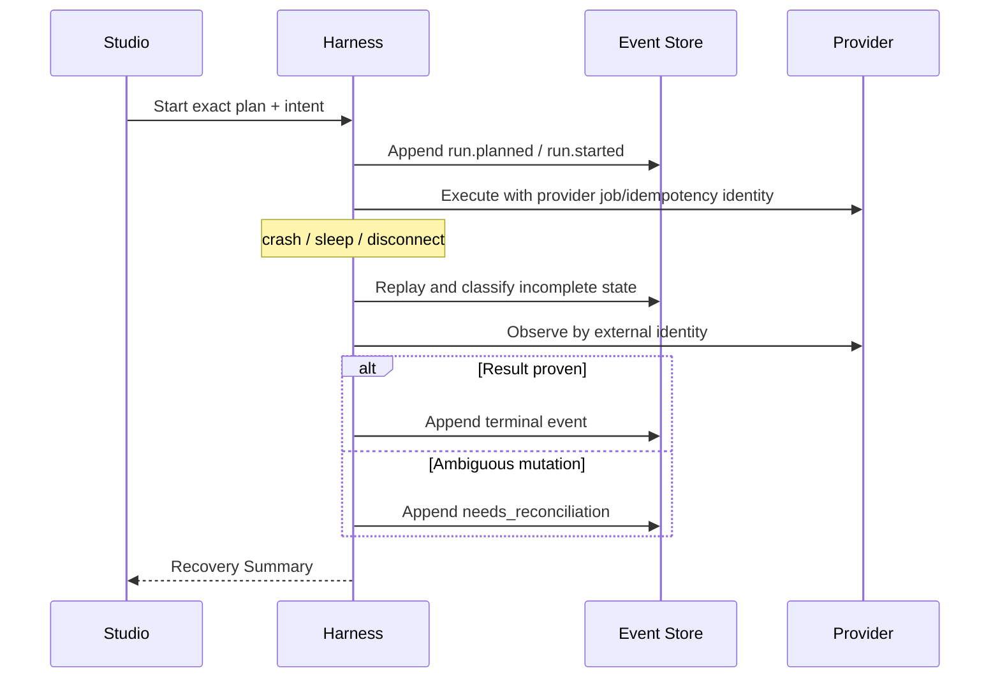

# Architecture: Event State, Recovery, and Reconciliation

**ID:** ARCH-002
**Project:** clark-pro
**Type:** Data Flow
**Version:** 1.0
**Updated:** 2026-07-13
**Sources:** [Architecture](../../../clark-pro/architecture.md), [Implementation contracts](../../../clark-pro/product/04-architecture-and-tech-stack.md)

---

## Purpose

Define how append-only events, exact run plans, external job identities, publication intents, and projection replay prevent lost or duplicated work.

Connected stories: `S-002-002`, `S-002-003`, `S-003-001`, `S-003-004`, `S-003-005`, `S-004-003`, `S-008-002`, `S-008-003`, `S-009-004`. Connected flows: UF-006, UF-007, UF-009, UF-015.

## The Goal

After renderer reload, Harness death, Mac sleep, network loss, or ambiguous provider response, Clark can classify every item and resume only under safe fresh authority.

## Current State

The bounded Ground implementation proves the Electron/Harness/event/contract shape for selected stories. Production signing, complete provider execution, broad creator loops, remote sync, and hosted operations remain release-gated rather than assumed complete.

## Architectural Decision

### Decision

Use immutable versioned events as canonical state, persist the exact validated run plan and external identities, rebuild projections deterministically, and route ambiguous mutations into explicit reconciliation instead of automatic retry.

### Rationale

This decision preserves local canonical ownership, exact-version provenance, inspectable authority, deterministic recovery, and replaceable dependencies while allowing each release to extend the same contracts.

### Alternatives Considered

| Approach | Why Rejected |
|----------|--------------|
| Mutable job rows only | Cannot reconstruct why state changed or safely prove idempotence after crash. |
| Recompile latest plan on recovery | Mutable definitions could change authority or inputs under an old approval. |
| Retry on timeout | A provider may have committed the mutation before the response was lost. |

## Design

## Constraints & Non-Goals

- Aggregate versions and command IDs enforce idempotence; external intent identity is retained even when provider support is weak.
- Approval applies only to the exact artifact version and required platform adaptation.
- Restore validates fully in quarantine before active canonical state changes.
- This architecture does not claim that a planned provider, Tool Pack, remote service, or hosted control already exists.

## Implementation Notes

- Persist input hashes, capability revisions, permission snapshot, budget, provider job ID, and checkpoint.
- Classify orphaned calls and revoke leases before retrying under fresh authority.
- Projection deletion/rebuild is a required release test, not a production recovery shortcut.
- Emit only allowlisted operational telemetry with correlation IDs and no raw creative, secret, identity, path, or prompt content.

## Consumed By

| Consumer | How |
|----------|-----|
| S-002-002 | Implements or verifies this architecture boundary. |
| S-002-003 | Implements or verifies this architecture boundary. |
| S-003-001 | Implements or verifies this architecture boundary. |
| S-003-004 | Implements or verifies this architecture boundary. |
| S-003-005 | Implements or verifies this architecture boundary. |
| S-004-003 | Implements or verifies this architecture boundary. |
| S-008-002 | Implements or verifies this architecture boundary. |
| S-008-003 | Implements or verifies this architecture boundary. |
| S-009-004 | Implements or verifies this architecture boundary. |
| UF-006, UF-007, UF-009, UF-015 | Exercises the boundary through the linked user journey. |
| arch.md | Summarizes this decision for release and coding-agent handoff. |

## Change Log

| Date | Version | Author | Change |
|------|---------|--------|--------|
| 2026-07-13 | 1.0 | PM Agent | Created from accepted Clark Pro architecture and ADR evidence. |
