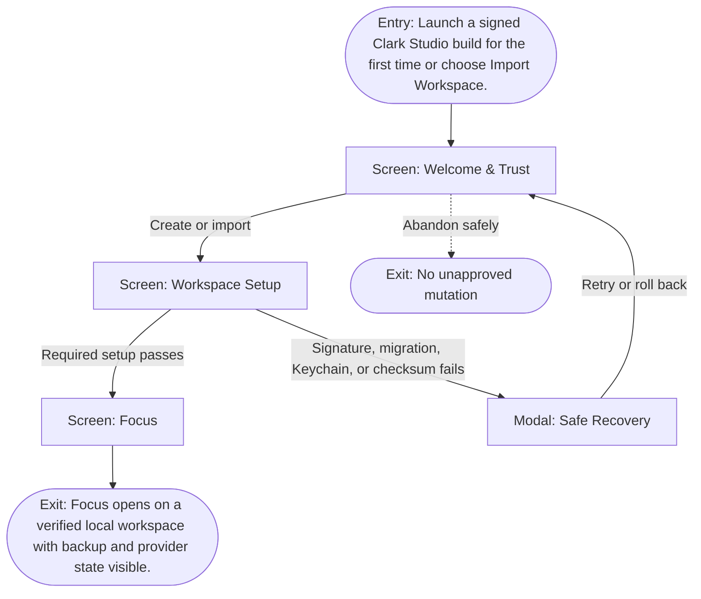

# User Flow: Install and establish trust

**ID:** UF-001
**Project:** clark-pro
**Epic:** E-001, E-002, E-003
**Stage:** Ready
**Version:** 1.0
**Created:** 2026-07-13
**Updated:** 2026-07-13
**Persona:** The Trust-Conscious Operator
**Sources:** [Authoritative source flow](../../clark-pro/product/02-user-flows.md), [Product brief](../brief.md)

---

## Overview

A creator establishes a trustworthy local workspace, confirms backup and credential boundaries, imports identity context, and reaches the first actionable Focus state without being forced to connect external services.

## Entry Point

- Launch a signed Clark Studio build for the first time or choose Import Workspace.

## Stories Covered

- S-001-001 — Versioned Contracts and Upcasters
- S-001-002 — Ground Prototype and Evidence Ledger
- S-002-001 — Hardened Mac Shell Boundary
- S-002-003 — Workspace Portability and Backup Recovery
- S-002-004 — Keychain, Signing, and Safe Updates
- S-003-001 — Immutable Idea Capture and Revision Lineage

## Flow

## Screens

### Screen: Welcome & Trust

- **Purpose:** Explain Clark’s local-first ownership and authority model before any setup choice.
- **Key content:** Signed-build status, local ownership summary, optional remote-call disclosure, memory/credential/Skill/Tool Pack distinctions, diagnostics link, create/import choices.
- **Primary action:** Choose Create workspace or Import workspace.
- **Transitions:**
  - Create workspace → Workspace Setup
  - Import workspace → Workspace Setup after validation
  - Unsupported or invalid build → Safe Recovery
- **Stories:** S-001-002, S-002-003, S-002-004, S-003-001

### Screen: Workspace Setup

- **Purpose:** Create or import the canonical local workspace, backup destination, provider, and Brand Constitution.
- **Key content:** Workspace identity, storage location, backup recipient, provider connection, Brand Constitution import, optional connector setup, guided template choice.
- **Primary action:** Complete required local setup and continue to Focus.
- **Transitions:**
  - Valid setup → Focus
  - Import or migration failure → Safe Recovery
  - Skip optional connector → Focus
- **Stories:** S-001-002, S-002-003, S-002-004, S-003-001

### Modal: Safe Recovery

- **Purpose:** Explain why setup or launch failed and protect the last trusted workspace state.
- **Key content:** Failure class, affected operation, last trusted version, diagnostics preview, read-only option, retry, rollback.
- **Primary action:** Choose retry, roll back, or open read-only.
- **Transitions:**
  - Retry → prior screen
  - Rollback → Welcome & Trust or Recovery Summary
  - Read-only → Focus with mutation controls disabled
- **Stories:** S-001-002, S-002-003, S-002-004, S-003-001

### Screen: Focus

- **Purpose:** Present the next creator decision, required inputs, active gates, and resumable work without exposing the whole graph.
- **Key content:** Inbox count, current project, next decision, run readiness, budget, selected accounts and Brand Constitution, recovery summary, recent activity.
- **Primary action:** Make the next decision or open the relevant supporting surface.
- **Transitions:**
  - Open structure or lineage → Canvas
  - Open exact-version decision → Review
  - Approved work → Timeline
  - Recovered work → remain in Focus with status
- **Stories:** S-001-002, S-002-003, S-002-004, S-003-001

## Exit Points

- **Success:** Focus opens on a verified local workspace with backup and provider state visible.
- **Abandon:** The creator can leave before the explicit decision; drafts and verified prior state remain available.
- **Error:** No failed import or setup operation mutates the last trusted workspace; diagnostics and rollback remain available.

---
