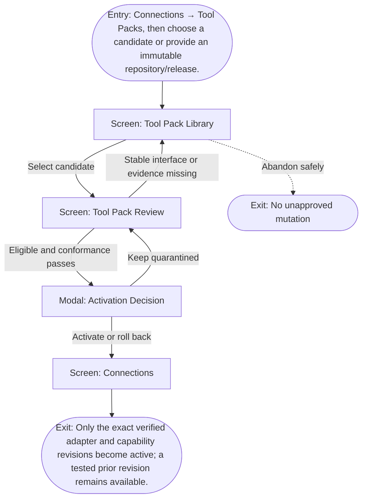

# User Flow: Evaluate and install a Tool Pack

**ID:** UF-003
**Project:** clark-pro
**Epic:** E-006
**Stage:** Ready
**Version:** 1.0
**Created:** 2026-07-13
**Updated:** 2026-07-13
**Persona:** The Trust-Conscious Operator
**Sources:** [Authoritative source flow](../../clark-pro/product/02-user-flows.md), [Product brief](../brief.md)

---

## Overview

A workspace administrator moves an external engine through immutable-source review, the interface ladder, quarantine, conformance, explicit activation, update, and rollback without treating a Git URL as a trusted plugin.

## Entry Point

- Connections → Tool Packs, then choose a candidate or provide an immutable repository/release.

## Stories Covered

- S-006-001 — Tool Pack Quarantine and Trust Gates
- S-006-002 — Atomic Tool Pack Activation and Rollback
- S-006-003 — OpenCut Candidate Blocked Upstream
- S-006-004 — Real Third-Party Acquisition and Execution
- S-006-005 — Clark Kit SDK and Community Compatibility

## Flow

## Screens

### Screen: Tool Pack Library

- **Purpose:** Discover reuse-first integration candidates without implying that discovery equals installation or trust.
- **Key content:** Bundled, verified, community, local, and blocked-upstream candidates; source revision; interface type; compatibility and risk summaries.
- **Primary action:** Select a candidate for evidence review.
- **Transitions:**
  - Select candidate → Tool Pack Review
  - Add repository or release → Tool Pack Review in discovered state
- **Stories:** S-006-001, S-006-002, S-006-003, S-006-004, S-006-005

### Screen: Tool Pack Review

- **Purpose:** Inspect immutable source, legal, supply-chain, interface, permission, converter, UI, migration, and rollback evidence.
- **Key content:** Revision/hash, license, SBOM, vulnerability/provenance, interface ladder, adapter/capability inventory, converters/loss, UI origins, tests, compatibility, migration, rollback.
- **Primary action:** Acquire to quarantine or keep blocked.
- **Transitions:**
  - Eligible and acquire → Activation Decision after conformance
  - Blocked evidence → remain blocked with zero authority
  - Back → Tool Pack Library
- **Stories:** S-006-001, S-006-002, S-006-003, S-006-004, S-006-005

### Modal: Activation Decision

- **Purpose:** Bind activation or rollback to an exact tested Tool Pack revision and explicit creator decision.
- **Key content:** Revision diff, effective capabilities, workspace scope, permission/egress changes, migration preview, rollback target, evidence receipt.
- **Primary action:** Activate, limit, reject, or roll back.
- **Transitions:**
  - Activate → Connections
  - Limit → Tool Pack Review
  - Reject → Tool Pack Review
  - Rollback → Connections with prior revision
- **Stories:** S-006-001, S-006-002, S-006-003, S-006-004, S-006-005

### Screen: Connections

- **Purpose:** Manage capabilities, social accounts, MCP clients, Tool Packs, Skills, and their effective workspace authority.
- **Key content:** Source and trust filters, connection cards, health, scopes, trust states, affected schedules, revoke controls, developer mode.
- **Primary action:** Select a connection or add a governed capability.
- **Transitions:**
  - Select capability → Capability Trust Review
  - Select Tool Pack → Tool Pack Review
  - Select Skill → Skill Review
  - Register client → Client Pairing
- **Stories:** S-006-001, S-006-002, S-006-003, S-006-004, S-006-005

## Exit Points

- **Success:** Only the exact verified adapter and capability revisions become active; a tested prior revision remains available.
- **Abandon:** The creator can leave before the explicit decision; drafts and verified prior state remain available.
- **Error:** Blocked or failed candidates retain zero adapter, capability, Skill, converter, UI, credential, filesystem, network, build, or execution authority.

---
