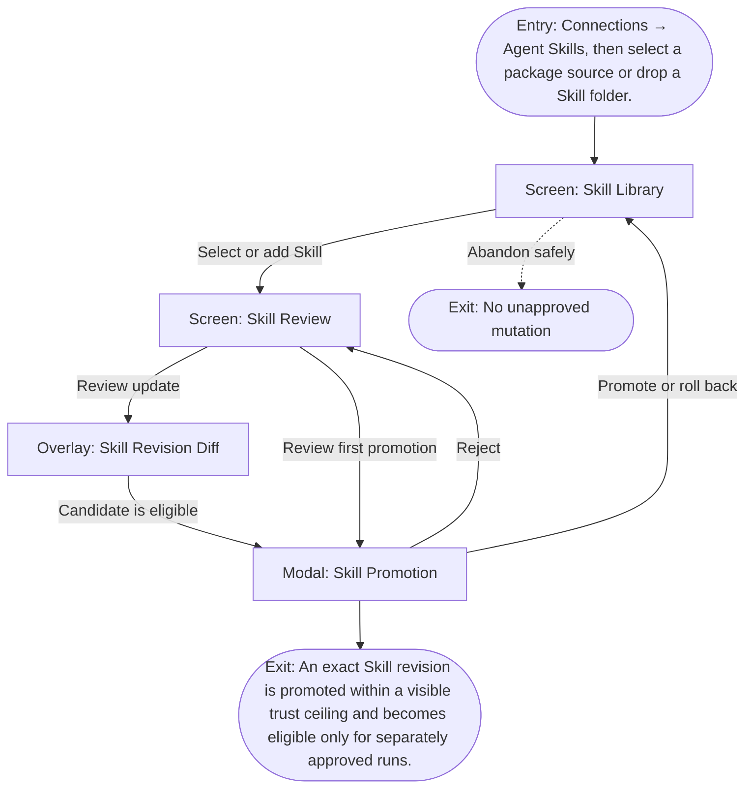

# User Flow: Install an Agent Skill

**ID:** UF-004
**Project:** clark-pro
**Epic:** E-007
**Stage:** Ready
**Version:** 1.0
**Created:** 2026-07-13
**Updated:** 2026-07-13
**Persona:** The Trust-Conscious Operator
**Sources:** [Authoritative source flow](../../clark-pro/product/02-user-flows.md), [Product brief](../brief.md)

---

## Overview

A workspace administrator validates exact Skill bytes, requested tools, compatibility, fixtures, and the effective permission intersection before promotion, while retaining an exact rollback revision.

## Entry Point

- Connections → Agent Skills, then select a package source or drop a Skill folder.

## Stories Covered

- S-007-001 — Bundled Class A Skill Trust Lifecycle
- S-007-002 — Skill Update, Expansion Denial, and Rollback
- S-007-003 — Run-Scoped Skill Invocation and Receipts
- S-007-004 — Community Skills and Class B/C Sandbox

## Flow

## Screens

### Screen: Skill Library

- **Purpose:** Discover bundled and community procedures while preserving trust class, quarantine, and compatibility state.
- **Key content:** Skill name, source identity, class, requested capabilities, compatibility, state, active revision, available update.
- **Primary action:** Select a Skill for inspection.
- **Transitions:**
  - Select Skill → Skill Review
  - Drop folder → Skill Review in quarantine
- **Stories:** S-007-001, S-007-002, S-007-003, S-007-004

### Screen: Skill Review

- **Purpose:** Inspect exact Skill bytes, requested tools, effective permission intersection, compatibility, fixtures, and trust ceiling.
- **Key content:** Source hash, files, hidden-executable scan, requested tools/domains, installed capabilities, effective permission intersection, fixture results, revision history.
- **Primary action:** Open promotion decision or compare a revision.
- **Transitions:**
  - Promote or limit → Skill Promotion
  - Compare update → Skill Revision Diff
  - Reject → Skill Library
- **Stories:** S-007-001, S-007-002, S-007-003, S-007-004

### Overlay: Skill Revision Diff

- **Purpose:** Compare procedure, tools, permissions, compatibility, fixtures, and recovery behavior between Skill revisions.
- **Key content:** File diff, manifest diff, capability expansion, permission changes, fixture/regression results, compatibility, rollback target.
- **Primary action:** Continue to promotion or keep the prior revision.
- **Transitions:**
  - Promote candidate → Skill Promotion
  - Keep prior → Skill Review
- **Stories:** S-007-001, S-007-002, S-007-003, S-007-004

### Modal: Skill Promotion

- **Purpose:** Record the explicit promotion, limitation, rejection, or rollback decision for an exact Skill revision.
- **Key content:** Revision, trust class, capability ceiling, workspace scope, fixture summary, regression result, prior rollback revision.
- **Primary action:** Promote within the shown ceiling, reject, or roll back.
- **Transitions:**
  - Promote → Skill Library
  - Reject → Skill Review
  - Rollback → Skill Library with prior revision
- **Stories:** S-007-001, S-007-002, S-007-003, S-007-004

## Exit Points

- **Success:** An exact Skill revision is promoted within a visible trust ceiling and becomes eligible only for separately approved runs.
- **Abandon:** The creator can leave before the explicit decision; drafts and verified prior state remain available.
- **Error:** Invalid, incompatible, expanded, or hostile packages remain quarantined and cannot execute.

---
