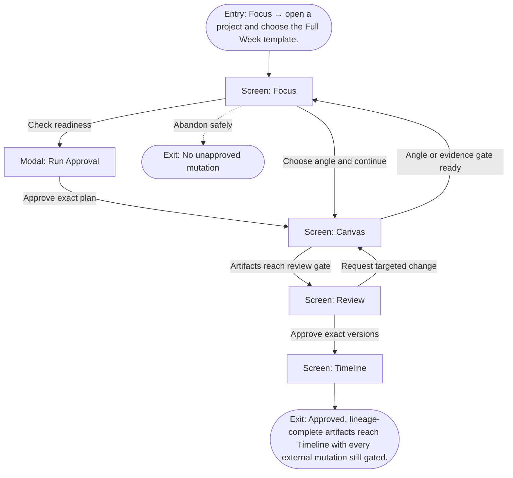

# User Flow: Run the Full-Week loop

**ID:** UF-006
**Project:** clark-pro
**Epic:** E-003, E-005, E-006, E-007, E-008, E-009
**Stage:** Ready
**Version:** 1.0
**Created:** 2026-07-13
**Updated:** 2026-07-13
**Persona:** The Operator-Creator
**Sources:** [Authoritative source flow](../../clark-pro/product/02-user-flows.md), [Product brief](../brief.md)

---

## Overview

The primary Clark journey moves from inputs and a dry-run plan through evidence, angle choice, bounded parallel creation, exact-version review, and scheduling while preserving memory, Skill, Tool Pack, permission, budget, and lineage receipts.

## Entry Point

- Focus → open a project and choose the Full Week template.

## Stories Covered

- S-003-003 — Source Ingestion and Claim Ledger
- S-003-004 — Writing, Media, and Platform Variants
- S-003-005 — Version-Specific Review and Policy Gates
- S-005-003 — Semantic Retrieval and Reflection Lineage
- S-006-004 — Real Third-Party Acquisition and Execution
- S-007-003 — Run-Scoped Skill Invocation and Receipts
- S-008-002 — Postiz Scheduling and Publication Ledger
- S-009-004 — Four-Week Whole-Product Proof

## Flow

## Screens

### Screen: Focus

- **Purpose:** Present the next creator decision, required inputs, active gates, and resumable work without exposing the whole graph.
- **Key content:** Inbox count, current project, next decision, run readiness, budget, selected accounts and Brand Constitution, recovery summary, recent activity.
- **Primary action:** Make the next decision or open the relevant supporting surface.
- **Transitions:**
  - Open structure or lineage → Canvas
  - Open exact-version decision → Review
  - Approved work → Timeline
  - Recovered work → remain in Focus with status
- **Stories:** S-003-003, S-003-004, S-003-005, S-005-003, S-006-004, S-007-003, S-008-002, S-009-004

### Modal: Run Approval

- **Purpose:** Show the compiled run plan, permissions, paid calls, selected revisions, budget, and review gates before execution.
- **Key content:** Plan hash, inputs, capability and Skill revisions, permission leases, predicted cost/range, checkpoints, approval gates, remote eligibility.
- **Primary action:** Approve this exact plan, edit inputs, or cancel.
- **Transitions:**
  - Approve → Focus then Canvas as run starts
  - Edit → Focus
  - Cancel → Focus
- **Stories:** S-003-003, S-003-004, S-003-005, S-005-003, S-006-004, S-007-003, S-008-002, S-009-004

### Screen: Canvas

- **Purpose:** Expose the typed creative graph, lineage, evidence gaps, decisions, branches, staleness, and run state as an inspectable projection.
- **Key content:** Lanes, typed nodes, edges, selected-node inspector, evidence readiness, lineage, stale markers, branch controls, keyboard help.
- **Primary action:** Inspect or change an upstream decision and preview consequences.
- **Transitions:**
  - Open review gate → Review
  - Change decision → Impact Preview
  - Return to next decision → Focus
- **Stories:** S-003-003, S-003-004, S-003-005, S-005-003, S-006-004, S-007-003, S-008-002, S-009-004

### Screen: Review

- **Purpose:** Compare exact artifact versions with evidence, policy, cost, lineage, and creator decisions before mutation.
- **Key content:** Review queue, paired text diff or synchronized media, sources, model/provider, Skill and memory revisions, policies, annotations, cost, approval status.
- **Primary action:** Select, edit, reject, or request targeted changes.
- **Transitions:**
  - Compare versions → Version Comparison
  - Decide → Approval Decision
  - Approved for distribution → Timeline
  - Inspect lineage → Canvas
- **Stories:** S-003-003, S-003-004, S-003-005, S-005-003, S-006-004, S-007-003, S-008-002, S-009-004

### Screen: Timeline

- **Purpose:** Coordinate approved artifacts, account requirements, schedules, submission, verification, and reconciliation states.
- **Key content:** Calendar/list modes, artifact and account, approval state, platform requirements, scheduled time, publication state, receipts, affected-account warnings.
- **Primary action:** Schedule, publish now, reschedule, reconcile, cancel, or export.
- **Transitions:**
  - Schedule or publish → Publication Approval
  - Ambiguous state → Reconciliation
  - Unavailable connector → Export Package
  - Open artifact → Review
- **Stories:** S-003-003, S-003-004, S-003-005, S-005-003, S-006-004, S-007-003, S-008-002, S-009-004

## Exit Points

- **Success:** Approved, lineage-complete artifacts reach Timeline with every external mutation still gated.
- **Abandon:** The creator can leave before the explicit decision; drafts and verified prior state remain available.
- **Error:** A failed branch pauses or reconciles without erasing reusable work, approval context, or the creator’s ability to change capabilities.

---
