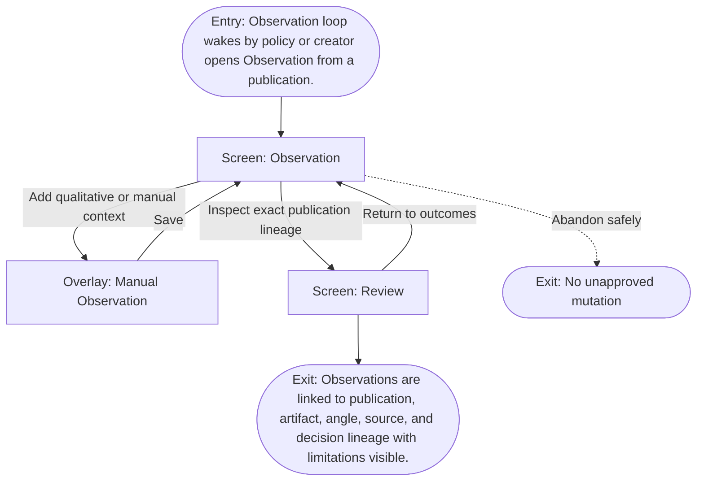

# User Flow: Observe outcomes

**ID:** UF-010
**Project:** clark-pro
**Epic:** E-008
**Stage:** Ready
**Version:** 1.0
**Created:** 2026-07-13
**Updated:** 2026-07-13
**Persona:** The Operator-Creator
**Sources:** [Authoritative source flow](../../clark-pro/product/02-user-flows.md), [Product brief](../brief.md)

---

## Overview

A creator reviews platform and manual outcomes with exact lineage, freshness, missingness, sample count, and definition boundaries before any learning proposal is made.

## Entry Point

- Observation loop wakes by policy or creator opens Observation from a publication.

## Stories Covered

- S-008-004 — Observation Ingestion and Evidence Review

## Flow

## Screens

### Screen: Observation

- **Purpose:** Review quantitative, qualitative, and manual outcomes attached to exact publication lineage.
- **Key content:** Freshness, missingness, platform definitions, sample counts, cohort controls, ranges, cost, satisfaction, comments, qualitative context.
- **Primary action:** Inspect evidence or add a manual observation.
- **Transitions:**
  - Inspect lineage → Review
  - Add judgment → Manual Observation
  - Propose learning → Memory
- **Stories:** S-008-004

### Overlay: Manual Observation

- **Purpose:** Capture qualitative judgment or manual values with source and uncertainty rather than pretending they came from a connector.
- **Key content:** Observation type, bounded value or note, source, observed date, freshness, confidence/context, exact publication link.
- **Primary action:** Save the manual observation.
- **Transitions:**
  - Save → Observation
  - Cancel → Observation
- **Stories:** S-008-004

### Screen: Review

- **Purpose:** Compare exact artifact versions with evidence, policy, cost, lineage, and creator decisions before mutation.
- **Key content:** Review queue, paired text diff or synchronized media, sources, model/provider, Skill and memory revisions, policies, annotations, cost, approval status.
- **Primary action:** Select, edit, reject, or request targeted changes.
- **Transitions:**
  - Compare versions → Version Comparison
  - Decide → Approval Decision
  - Approved for distribution → Timeline
  - Inspect lineage → Canvas
- **Stories:** S-008-004

## Exit Points

- **Success:** Observations are linked to publication, artifact, angle, source, and decision lineage with limitations visible.
- **Abandon:** The creator can leave before the explicit decision; drafts and verified prior state remain available.
- **Error:** Unavailable, stale, deleted, or incomparable data remains visibly missing rather than silently merged.

---
