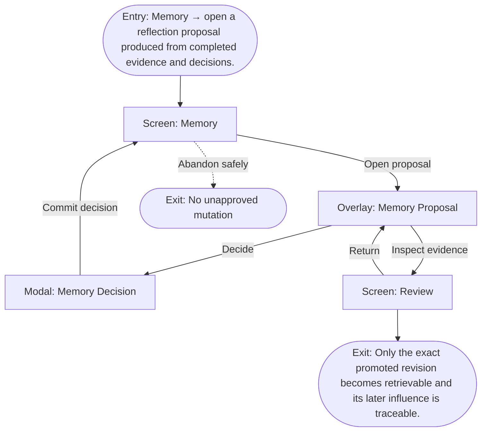

# User Flow: Reflect and promote memory

**ID:** UF-011
**Project:** clark-pro
**Epic:** E-005, E-008
**Stage:** Ready
**Version:** 1.0
**Created:** 2026-07-13
**Updated:** 2026-07-13
**Persona:** The Operator-Creator
**Sources:** [Authoritative source flow](../../clark-pro/product/02-user-flows.md), [Product brief](../brief.md)

---

## Overview

A creator inspects a small evidence-linked memory proposal and explicitly promotes, edits, disputes, defers, or rejects it; later influence remains visible.

## Entry Point

- Memory → open a reflection proposal produced from completed evidence and decisions.

## Stories Covered

- S-005-001 — Evidence-Bound Memory Promotion
- S-005-003 — Semantic Retrieval and Reflection Lineage
- S-008-005 — Experiment and Strategy Loop

## Flow

## Screens

### Screen: Memory

- **Purpose:** Inspect active beliefs, proposals, evidence, scope, sensitivity, retrieval history, influence, correction, and forgetting.
- **Key content:** Memory metrics, search/filter, item list, proposal state, statement, confidence, evidence, contradictions, scope, sensitivity, expiry, retrievals, influenced artifacts.
- **Primary action:** Review a proposal or inspect/correct an active item.
- **Transitions:**
  - Open proposal → Memory Proposal
  - Open history → Memory History
  - Forget → Forget Memory
  - Inspect influenced artifact → Review
- **Stories:** S-005-001, S-005-003, S-008-005

### Overlay: Memory Proposal

- **Purpose:** Review a small evidence-linked belief proposal before it can influence retrieval.
- **Key content:** Statement, evidence, contradiction, confidence, sensitivity, scope, expiry, retrieval policy, originating trajectory.
- **Primary action:** Approve, edit, dispute, defer, or reject.
- **Transitions:**
  - Decide → Memory Decision
  - Inspect evidence → Review
  - Close → Memory
- **Stories:** S-005-001, S-005-003, S-008-005

### Modal: Memory Decision

- **Purpose:** Record a revision-specific promote, edit, dispute, defer, or reject decision.
- **Key content:** Exact revision, final statement, scope, sensitivity, expiry, retrieval policy, reason, actor.
- **Primary action:** Commit the selected memory decision.
- **Transitions:**
  - Promote or edit → Memory
  - Dispute or reject → Memory
  - Cancel → Memory Proposal
- **Stories:** S-005-001, S-005-003, S-008-005

### Screen: Review

- **Purpose:** Compare exact artifact versions with evidence, policy, cost, lineage, and creator decisions before mutation.
- **Key content:** Review queue, paired text diff or synchronized media, sources, model/provider, Skill and memory revisions, policies, annotations, cost, approval status.
- **Primary action:** Select, edit, reject, or request targeted changes.
- **Transitions:**
  - Compare versions → Version Comparison
  - Decide → Approval Decision
  - Approved for distribution → Timeline
  - Inspect lineage → Canvas
- **Stories:** S-005-001, S-005-003, S-008-005

## Exit Points

- **Success:** Only the exact promoted revision becomes retrievable and its later influence is traceable.
- **Abandon:** The creator can leave before the explicit decision; drafts and verified prior state remain available.
- **Error:** Insufficient, contradictory, or sensitive evidence keeps the proposal inactive.

---
