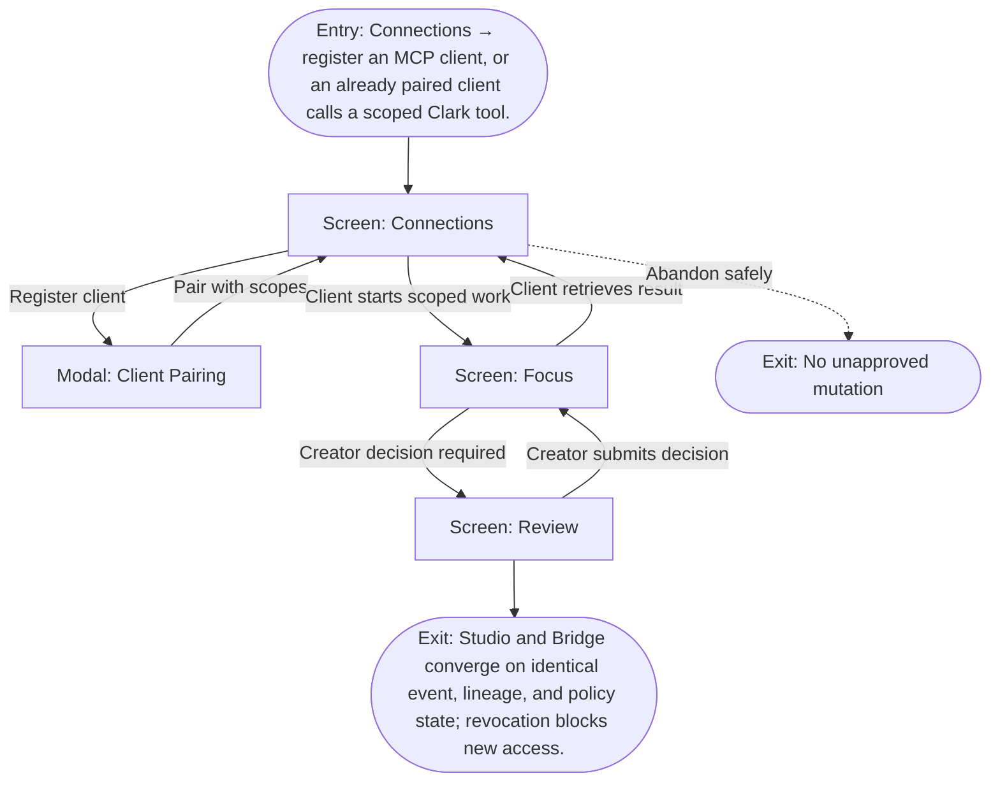

# User Flow: External agent uses Clark Bridge

**ID:** UF-013
**Project:** clark-pro
**Epic:** E-004
**Stage:** Ready
**Version:** 1.0
**Created:** 2026-07-13
**Updated:** 2026-07-13
**Persona:** The Integration Builder
**Sources:** [Authoritative source flow](../../clark-pro/product/02-user-flows.md), [Product brief](../brief.md)

---

## Overview

An external agent pairs with explicit scopes, uses Clark’s canonical command layer, reconnects to durable work, waits for creator review, and retrieves results without gaining ambient authority.

## Entry Point

- Connections → register an MCP client, or an already paired client calls a scoped Clark tool.

## Stories Covered

- S-004-002 — Scoped Clark Bridge Core
- S-004-003 — Durable Bridge Tasks and Client Pairing
- S-004-004 — External Client Examples and Compatibility

## Flow

## Screens

### Screen: Connections

- **Purpose:** Manage capabilities, social accounts, MCP clients, Tool Packs, Skills, and their effective workspace authority.
- **Key content:** Source and trust filters, connection cards, health, scopes, trust states, affected schedules, revoke controls, developer mode.
- **Primary action:** Select a connection or add a governed capability.
- **Transitions:**
  - Select capability → Capability Trust Review
  - Select Tool Pack → Tool Pack Review
  - Select Skill → Skill Review
  - Register client → Client Pairing
- **Stories:** S-004-002, S-004-003, S-004-004

### Modal: Client Pairing

- **Purpose:** Register an MCP client through one-time local pairing and explicit workspace, tool, resource, and job scopes.
- **Key content:** Client identity, one-time code, allowed workspaces/tools/resources, task support, token storage, expiry, revoke behavior.
- **Primary action:** Pair the client or cancel.
- **Transitions:**
  - Pair → Connections
  - Cancel → Connections
  - Invalid/expired code → remain
- **Stories:** S-004-002, S-004-003, S-004-004

### Screen: Focus

- **Purpose:** Present the next creator decision, required inputs, active gates, and resumable work without exposing the whole graph.
- **Key content:** Inbox count, current project, next decision, run readiness, budget, selected accounts and Brand Constitution, recovery summary, recent activity.
- **Primary action:** Make the next decision or open the relevant supporting surface.
- **Transitions:**
  - Open structure or lineage → Canvas
  - Open exact-version decision → Review
  - Approved work → Timeline
  - Recovered work → remain in Focus with status
- **Stories:** S-004-002, S-004-003, S-004-004

### Screen: Review

- **Purpose:** Compare exact artifact versions with evidence, policy, cost, lineage, and creator decisions before mutation.
- **Key content:** Review queue, paired text diff or synchronized media, sources, model/provider, Skill and memory revisions, policies, annotations, cost, approval status.
- **Primary action:** Select, edit, reject, or request targeted changes.
- **Transitions:**
  - Compare versions → Version Comparison
  - Decide → Approval Decision
  - Approved for distribution → Timeline
  - Inspect lineage → Canvas
- **Stories:** S-004-002, S-004-003, S-004-004

## Exit Points

- **Success:** Studio and Bridge converge on identical event, lineage, and policy state; revocation blocks new access.
- **Abandon:** The creator can leave before the explicit decision; drafts and verified prior state remain available.
- **Error:** Missing or revoked scope, hostile request metadata, or client disconnect preserves canonical work while denying unauthorized access.

---
