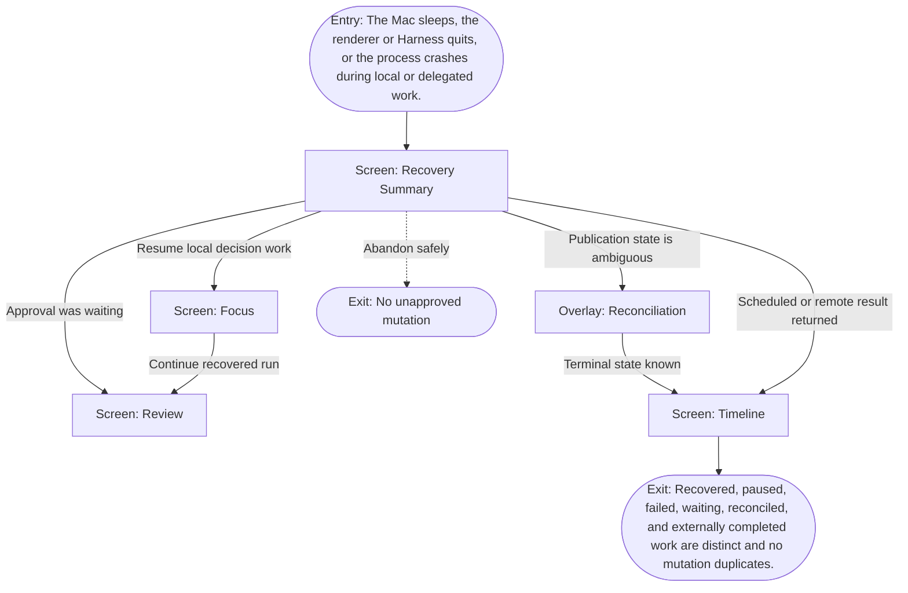

# User Flow: Mac sleeps, quits, or crashes

**ID:** UF-015
**Project:** clark-pro
**Epic:** E-002, E-004, E-008, E-009
**Stage:** Ready
**Version:** 1.0
**Created:** 2026-07-13
**Updated:** 2026-07-13
**Persona:** The Trust-Conscious Operator
**Sources:** [Authoritative source flow](../../clark-pro/product/02-user-flows.md), [Product brief](../brief.md)

---

## Overview

Clark checkpoints where possible, classifies every incomplete step on relaunch, reconnects external jobs, reconciles publication intent before retry, and returns the creator to an honest recovery summary.

## Entry Point

- The Mac sleeps, the renderer or Harness quits, or the process crashes during local or delegated work.

## Stories Covered

- S-002-002 — Durable Event Store and Run Recovery
- S-004-003 — Durable Bridge Tasks and Client Pairing
- S-008-002 — Postiz Scheduling and Publication Ledger
- S-009-002 — Encrypted Event Sync and Asset Mirror
- S-009-003 — Scoped Remote Workers and Schedules
- S-009-005 — Release, Hosted Continuity, and Tenant Isolation

## Flow

## Screens

### Screen: Recovery Summary

- **Purpose:** Classify incomplete local and delegated work after wake, relaunch, or crash and present safe next actions.
- **Key content:** Recovered, paused, failed, waiting approval, externally completed, and needs-reconciliation groups; checkpoint; provider identity; affected publication intents.
- **Primary action:** Resume, inspect, reconcile, or leave paused.
- **Transitions:**
  - Resume local → Focus
  - Review gate → Review
  - Publication ambiguity → Reconciliation
  - Scheduled work → Timeline
- **Stories:** S-002-002, S-004-003, S-008-002, S-009-003, S-009-005

### Overlay: Reconciliation

- **Purpose:** Resolve ambiguous external mutations and recovered work without blind retry.
- **Key content:** Intent, last known state, provider receipt, live lookup, possible outcomes, retry safety, operator choices, audit timeline.
- **Primary action:** Verify, mark failed, continue observing, export, or retry only when safe.
- **Transitions:**
  - Verified → Timeline
  - Continue observing → Timeline
  - Export → Export Package
  - Safe retry → Publication Approval
- **Stories:** S-002-002, S-004-003, S-008-002, S-009-003, S-009-005

### Screen: Focus

- **Purpose:** Present the next creator decision, required inputs, active gates, and resumable work without exposing the whole graph.
- **Key content:** Inbox count, current project, next decision, run readiness, budget, selected accounts and Brand Constitution, recovery summary, recent activity.
- **Primary action:** Make the next decision or open the relevant supporting surface.
- **Transitions:**
  - Open structure or lineage → Canvas
  - Open exact-version decision → Review
  - Approved work → Timeline
  - Recovered work → remain in Focus with status
- **Stories:** S-002-002, S-004-003, S-008-002, S-009-003, S-009-005

### Screen: Review

- **Purpose:** Compare exact artifact versions with evidence, policy, cost, lineage, and creator decisions before mutation.
- **Key content:** Review queue, paired text diff or synchronized media, sources, model/provider, Skill and memory revisions, policies, annotations, cost, approval status.
- **Primary action:** Select, edit, reject, or request targeted changes.
- **Transitions:**
  - Compare versions → Version Comparison
  - Decide → Approval Decision
  - Approved for distribution → Timeline
  - Inspect lineage → Canvas
- **Stories:** S-002-002, S-004-003, S-008-002, S-009-003, S-009-005

### Screen: Timeline

- **Purpose:** Coordinate approved artifacts, account requirements, schedules, submission, verification, and reconciliation states.
- **Key content:** Calendar/list modes, artifact and account, approval state, platform requirements, scheduled time, publication state, receipts, affected-account warnings.
- **Primary action:** Schedule, publish now, reschedule, reconcile, cancel, or export.
- **Transitions:**
  - Schedule or publish → Publication Approval
  - Ambiguous state → Reconciliation
  - Unavailable connector → Export Package
  - Open artifact → Review
- **Stories:** S-002-002, S-004-003, S-008-002, S-009-003, S-009-005

## Exit Points

- **Success:** Recovered, paused, failed, waiting, reconciled, and externally completed work are distinct and no mutation duplicates.
- **Abandon:** The creator can leave before the explicit decision; drafts and verified prior state remain available.
- **Error:** Unclassifiable work stays paused with diagnostics; local export remains available during hosted failure.

---
