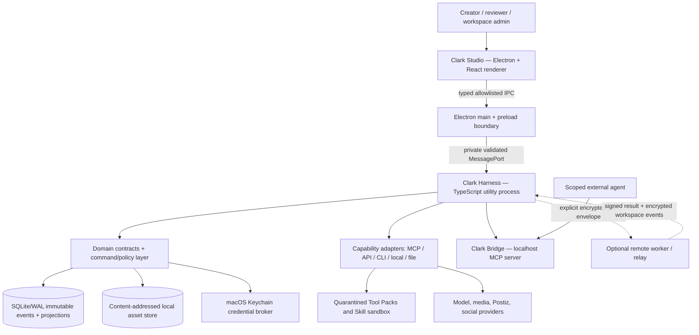

# Technical Architecture — Clark Pro

**Project:** clark-pro
**Version:** 1.0
**Updated:** 2026-07-13
**Sources:** [Full architecture](../../clark-pro/architecture.md), [Implementation contracts](../../clark-pro/product/04-architecture-and-tech-stack.md), [ADR registry](../../clark-pro/decisions/README.md)

---

## Architecture Thesis

Clark Pro is a local-first Mac creator operating system with a durable isolated Harness. The Mac owns canonical identity, event history, artifacts, memory, credentials, approvals, and policy decisions. Models, MCP servers, Tool Packs, social platforms, and optional workers are replaceable execution dependencies behind versioned contracts.

The permanent topology already exists in bounded form: Electron main/preload/renderer boundaries, a supervised TypeScript Harness utility process, JSON Schema 2020-12 contracts and generated types, SQLite/WAL canonical events and replayable projections, content-addressed assets, governed MCP, memory, Tool Pack, and Skill projections. Later releases extend this topology; they do not introduce a browser-owned or cloud-owned second state model.

## Runtime Topology

## Technology Decisions

| Layer | Decision | Why it fits Clark |
|-------|----------|-------------------|
| Mac shell | Electron, signed/notarized, Hardened Runtime | Native Mac surface plus TypeScript MCP/agent ecosystem and React Flow |
| Renderer | React + TypeScript + Vite; React Flow; Zustand only for transient UI | No SSR; canonical state remains in Harness projections |
| Process boundary | Sandboxed renderer, context isolation, named preload methods, sender validation | Renderer has no ambient filesystem, shell, network credential, or raw IPC authority |
| Harness | Supervised TypeScript utility process/local daemon | Long work and recovery survive renderer reload; provider failures remain isolated |
| Contracts | JSON Schema 2020-12, generated TypeScript, Ajv runtime validation | One schema authority across IPC, persistence, Bridge, packages, and history |
| Persistence | SQLite WAL repositories, immutable events, deterministic projections | Portable single-user canonical truth with recovery and audit |
| Assets | SHA-256 content-addressed objects plus typed metadata and previews | Integrity, deduplication, export, and future encrypted mirroring |
| Secrets | macOS Keychain broker and short-lived scoped leases | Raw credentials never enter renderer, ordinary database rows, logs, or prompts |
| Search / memory | SQLite FTS; bounded vector extension only for similarity retrieval | Structured, inspectable memory remains primary |
| Media | Isolated ffmpeg/ffprobe and provider workers | Deterministic validation with resource/time ceilings |
| Integrations | Capability contract beneath governed Tool Packs and Skills | Reuse excellent open-source engines without adopting their schema or authority |
| Observability | Clark allowlist schemas + manual OpenTelemetry instrumentation; local by default | Vendor-neutral diagnostics without silent content exfiltration |
| Hosted evolution | Encrypted event relay, content-addressed mirror, scoped signed worker envelopes | Adds continuity/team work while personal local replica remains usable and canonical |

## Trust Boundaries

| Boundary | Allowed | Explicitly forbidden |
|----------|---------|----------------------|
| Renderer → preload | Named schema-validated queries/commands | Raw IPC channels, executable strings, secret values, arbitrary paths/network |
| Main → Harness | Validated command envelopes over a private port | Unscoped environment inheritance or renderer-originated process commands |
| Harness → credential broker | Opaque credential reference and short lease | Credential values in domain events, logs, graph JSON, model context |
| Harness → capability | Exact revision, bounded input, intent, permission/budget lease | Ambient workspace access, undeclared egress, silent retry after ambiguous mutation |
| Tool Pack / Skill → runtime | Intersection of package declaration, creator ceiling, workspace policy, run grant | Trust by installation, permission expansion, canonical-model replacement |
| Local → remote worker | Signed, expiring, sensitivity-scoped job envelope | Whole-Keychain copy, unrelated memory, permanent broad authority |
| External client → Bridge | Local pairing, bearer outside renderer, workspace/tool/resource scope | Cross-workspace reads, approval authority by default, direct database access |

## Canonical Data and Recovery

Every accepted command appends a versioned event with actor, command, workspace, aggregate version, timestamp, and typed payload. Aggregate versions prevent accidental overwrites. Projection checkpoints are disposable and replayable. Per-workspace event-chain integrity, exact run-plan hashes, input hashes, intent IDs, provider job IDs, and content hashes provide recovery anchors.

- Artifact versions append; canonical selection is a decision event.
- Publication intent, provider submission, and verified live state remain distinct.
- Memory and Skill proposals stay inactive until an explicit revision-specific decision.
- Needs-reconciliation never blind-retries.
- Restore validates authentication, manifest, hashes, paths, schemas, and migration preview before canonical mutation.

## Integration and Plugin-First Boundary

Clark uses the accepted integration ladder: MCP → stable CLI → HTTP API → supported library → WASM component → supervised sidecar → typed file handoff → isolated browser automation → maintained fork. A Tool Pack is the installable governance unit that binds immutable source, license/SBOM/provenance, vulnerability evidence, adapter/capability revisions, converters, safe UI, compatibility, migrations, tests, updates, and rollback.

OpenCut remains a useful architecture reference and a pinned `blocked_upstream` fixture. Until a reviewed revision exposes a stable supported interface, Clark grants it no executable component. This prevents “plugin-first” from becoming “run arbitrary Git repositories.”

## Non-Functional Requirements

| Concern | Requirement | Evidence path |
|---------|-------------|---------------|
| Privacy | No telemetry or crash upload leaves the Mac before explicit opt-in/action; allowlist attributes only | ADR-0018 canary corpus and network capture |
| Durability | Forced termination at every supported run/publication state preserves exact identity and avoids duplicate mutation | Harness chaos fixtures + TF-015 |
| Portability | Encrypted age-v1 backups restore on a clean Mac with independent tooling and no raw secrets | ADR-0019 fixtures + T-002-003 |
| Accessibility | Keyboard and VoiceOver reach/announce every critical action and state; 200% zoom/reduced motion supported | S-002-005 and DS specs |
| Performance | Baseline p50/p95/p99 locally before setting targets; 50-object Canvas fixture remains responsive | Observability dashboard + S-002-005 |
| Security | Signed/notarized build, Hardened Runtime, scoped Keychain leases, supply-chain gates, sandbox hostile corpus | R-002 architecture gate and release QA |
| Availability | Personal local operation and complete export remain usable during hosted outage | S-009-005, HP-010, TF-015 |
| Compatibility | Every supported capability, Bridge client, Tool Pack, Skill, schema, migration, and rollback has versioned conformance evidence | Contract/MCP/package suites |

## Architecture Deep Dives

| Doc | Decision | Main consumers |
|-----|----------|----------------|
| [ARCH-001](arch/ARCH-001-local-runtime-and-trust-boundaries.md) | Permanent local process and authority topology | E-002, E-004 |
| [ARCH-002](arch/ARCH-002-event-state-recovery-and-reconciliation.md) | Event state, exact-version recovery, and ambiguous mutation handling | E-002, E-003, E-008 |
| [ARCH-003](arch/ARCH-003-governed-extension-execution.md) | Capability, Tool Pack, Skill, media, and external-engine isolation | E-004, E-006, E-007 |
| [ARCH-004](arch/ARCH-004-encrypted-sync-remote-work-and-hosted-evolution.md) | Team sync, device identity, remote workers, and tenant boundaries | E-009 |

## Release Architecture Sequence

| Release | Foundation before story work | Gate outcome |
|---------|------------------------------|--------------|
| R-001 Local Trust Core | Existing executable contract, boundary, event, MCP, memory, Tool Pack, and Skill evidence | QA validates the already-built bounded core; no new infrastructure gate |
| R-002 Single-User Creator Alpha | Release security/Keychain, portable restore, isolated external execution, privacy-safe observability | Closed until AT-002-001…004 are Done |
| R-003 Whole-Product Beta | Distribution/reconciliation, encrypted relay/sync, hosted isolation and operational telemetry | Closed until AT-003-001…003 are Done |
