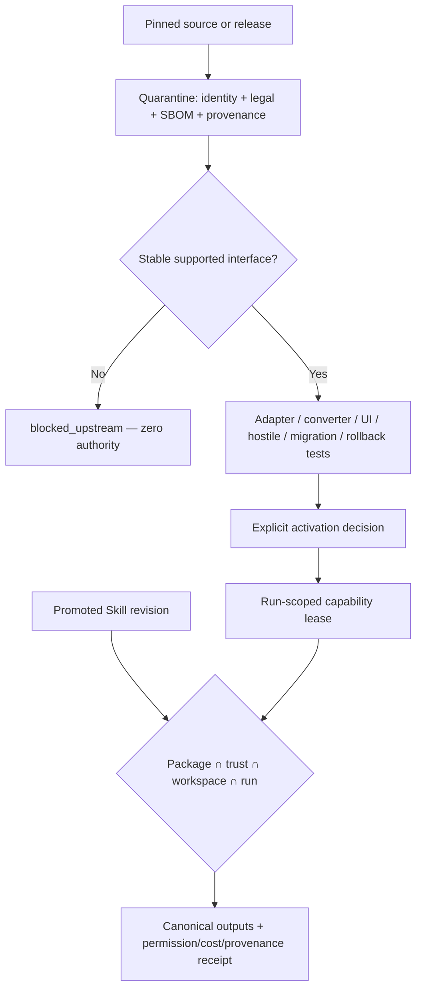

# Architecture: Governed Extension Execution

**ID:** ARCH-003
**Project:** clark-pro
**Type:** Integration Pattern
**Version:** 1.0
**Updated:** 2026-07-13
**Sources:** [Architecture](../../../clark-pro/architecture.md), [Implementation contracts](../../../clark-pro/product/04-architecture-and-tech-stack.md)

---

## Purpose

Define the reusable plugin-first boundary for MCP servers, open-source engines, Tool Packs, Skills, media workers, and converters without granting installation-time trust.

Connected stories: `S-004-001`, `S-006-001`, `S-006-002`, `S-006-003`, `S-006-004`, `S-006-005`, `S-007-001`, `S-007-002`, `S-007-003`, `S-007-004`, `S-007-005`. Connected flows: UF-002, UF-003, UF-004, UF-006, UF-012.

## The Goal

Clark can reuse mature external engines through stable supported interfaces while canonical creator truth, authority, provenance, compatibility, update, and rollback stay governed by Clark.

## Current State

The bounded Ground implementation proves the Electron/Harness/event/contract shape for selected stories. Production signing, complete provider execution, broad creator loops, remote sync, and hosted operations remain release-gated rather than assumed complete.

## Architectural Decision

### Decision

Represent specialized actions as versioned capabilities and distribute external integrations as quarantined Tool Packs. Skills provide governed procedure, not an authority bypass. Execution receives only the intersection of declaration, trust ceiling, workspace policy, and run grant.

### Rationale

This decision preserves local canonical ownership, exact-version provenance, inspectable authority, deterministic recovery, and replaceable dependencies while allowing each release to extend the same contracts.

### Alternatives Considered

| Approach | Why Rejected |
|----------|--------------|
| Embed a repository as a plugin | A Git URL does not define interface stability, legal posture, permissions, migration, or rollback. |
| Use Skills as executable packages | Conflates procedural knowledge with supply chain and runtime isolation. |
| Fork on first friction | Creates permanent security and maintenance ownership before Clark has proven differentiated value. |

## Design

## Constraints & Non-Goals

- Use interface ladder order unless a documented reuse review justifies deviation.
- External schemas never replace Clark workspace, workflow, approval, memory, provenance, or publication intent.
- Updates re-enter quarantine and retain a verified exact rollback revision.
- This architecture does not claim that a planned provider, Tool Pack, remote service, or hosted control already exists.

## Implementation Notes

- Acquisition verifies source/artifact identity before unpack or build and rejects traversal, symlink, and dependency-confusion attacks.
- UI is declarative, Clark-rendered, sandboxed-origin, or explicit external-app handoff.
- OpenCut remains blocked until a reviewed revision provides a stable supported boundary and full activation evidence.
- Emit only allowlisted operational telemetry with correlation IDs and no raw creative, secret, identity, path, or prompt content.

## Consumed By

| Consumer | How |
|----------|-----|
| S-004-001 | Implements or verifies this architecture boundary. |
| S-006-001 | Implements or verifies this architecture boundary. |
| S-006-002 | Implements or verifies this architecture boundary. |
| S-006-003 | Implements or verifies this architecture boundary. |
| S-006-004 | Implements or verifies this architecture boundary. |
| S-006-005 | Implements or verifies this architecture boundary. |
| S-007-001 | Implements or verifies this architecture boundary. |
| S-007-002 | Implements or verifies this architecture boundary. |
| S-007-003 | Implements or verifies this architecture boundary. |
| S-007-004 | Implements or verifies this architecture boundary. |
| S-007-005 | Implements or verifies this architecture boundary. |
| UF-002, UF-003, UF-004, UF-006, UF-012 | Exercises the boundary through the linked user journey. |
| arch.md | Summarizes this decision for release and coding-agent handoff. |
