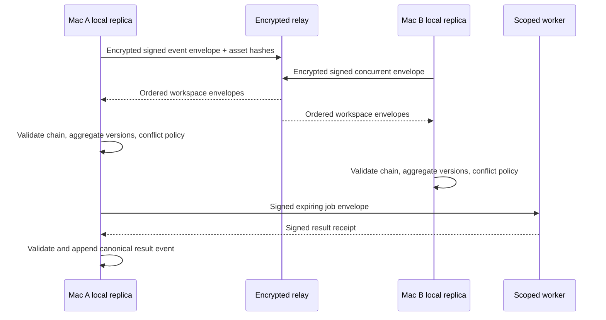

# Architecture: Encrypted Sync, Remote Work, and Hosted Evolution

**ID:** ARCH-004
**Project:** clark-pro
**Type:** Sync Strategy
**Version:** 1.0
**Updated:** 2026-07-13
**Sources:** [Architecture](../../../clark-pro/architecture.md), [Implementation contracts](../../../clark-pro/product/04-architecture-and-tech-stack.md)

---

## Purpose

Define how team event synchronization, asset mirroring, remote execution, organization policy, and tenant isolation extend rather than replace the personal local system.

Connected stories: `S-009-001`, `S-009-002`, `S-009-003`, `S-009-004`, `S-009-005`. Connected flows: UF-015.

## The Goal

Two Macs can work offline and converge without last-write-wins loss, while a remote worker can continue explicitly delegated work without receiving unrelated personal memory or credentials.

## Current State

The bounded Ground implementation proves the Electron/Harness/event/contract shape for selected stories. Production signing, complete provider execution, broad creator loops, remote sync, and hosted operations remain release-gated rather than assumed complete.

## Architectural Decision

### Decision

Synchronize encrypted workspace-scoped event envelopes and content-addressed assets through a relay, preserve aggregate ordering and explicit conflict decisions, and execute remote jobs from signed expiring envelopes with device identity and scoped credential delegation.

### Rationale

This decision preserves local canonical ownership, exact-version provenance, inspectable authority, deterministic recovery, and replaceable dependencies while allowing each release to extend the same contracts.

### Alternatives Considered

| Approach | Why Rejected |
|----------|--------------|
| Cloud database becomes canonical | Makes local ownership and hosted-outage operation false. |
| Raw last-write-wins row sync | Can erase concurrent approvals, decisions, and artifact versions. |
| Copy personal Keychain to worker | Expands authority far beyond the named job and weakens revocation. |

## Design

## Constraints & Non-Goals

- Cloud provider and tenancy service are selected during R-003 execution; contracts remain provider-neutral until then.
- Personal and team creator models are separate unless an explicit share event exists.
- Local export must remain complete and usable without relay or hosted service.
- This architecture does not claim that a planned provider, Tool Pack, remote service, or hosted control already exists.

## Implementation Notes

- Use per-device identity, replay protection, expiry, revocation, and sensitivity policy in every envelope.
- Assets mirror by content hash; metadata and access remain workspace scoped.
- Hosted logs and traces must use platform audit logs plus Clark application audit events without creative content.
- Emit only allowlisted operational telemetry with correlation IDs and no raw creative, secret, identity, path, or prompt content.

## Consumed By

| Consumer | How |
|----------|-----|
| S-009-001 | Implements or verifies this architecture boundary. |
| S-009-002 | Implements or verifies this architecture boundary. |
| S-009-003 | Implements or verifies this architecture boundary. |
| S-009-004 | Implements or verifies this architecture boundary. |
| S-009-005 | Implements or verifies this architecture boundary. |
| UF-015 | Exercises the boundary through the linked user journey. |
| arch.md | Summarizes this decision for release and coding-agent handoff. |
