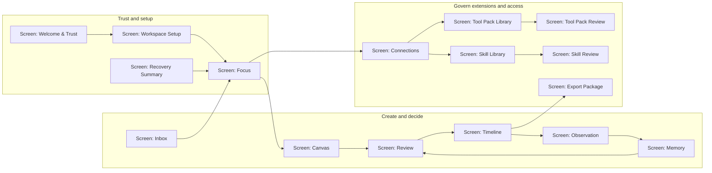

# Clark Pro Screen Sitemap

**Project:** clark-pro
**Version:** 1.0
**Updated:** 2026-07-13

---

## Navigation Contract

- Focus is the first operational destination and the return point after setup or recovery.
- Canvas explains structure and impact; Review owns exact-version decisions; Timeline owns external intent state.
- Connections governs capabilities, accounts, clients, Tool Packs, and Skills.
- Observation and Memory close the evidence-to-learning loop without silent promotion.
